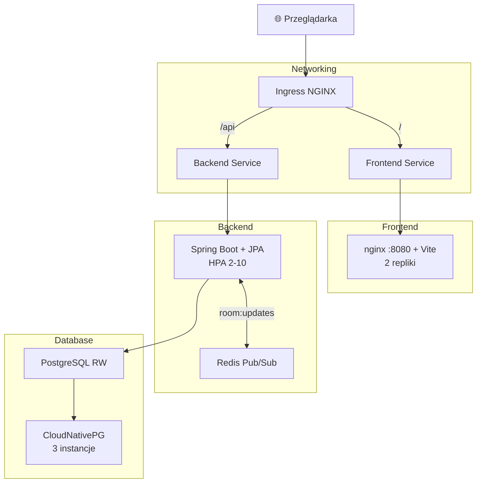

# Państwa Miasta

Multiplayerowa gra słowna wdrożona na Kubernetes (Helm). Gracze tworzą pokoje, dołączają kodem, wypełniają kategorie na losową literę, głosują na odpowiedzi — stan synchronizowany w czasie rzeczywistym przez WebSocket.

Projekt demonstruje pełny stack: React + Spring Boot, PostgreSQL HA (CloudNativePG), Redis Pub/Sub między replikami, HPA, hardening produkcyjny (TLS, NetworkPolicies, non-root, Sealed Secrets).

## Funkcjonalności

**Gameplay:** publiczne/prywatne pokoje, kod dołączenia, gra wieloosobowa na żywo, głosowanie, auto-koniec rund, rejoin po odświeżeniu.

**Infrastruktura:** JWT bez kont, WebSocket, Redis Pub/Sub, CloudNativePG (3 instancje), Helm + HPA (2–10 replik backendu), Actuator/Prometheus, rate limiting, TLS i Redis Sentinel w prod.

## Architektura



Frontend używa relatywnego prefixu `/api` — ten sam build działa za ingress dev i prod.

### Stack

| Komponent | Technologia |
| --------- | ----------- |
| Frontend | React 19, Vite, Tailwind, nginx unprivileged |
| Backend | Spring Boot 4, Java 21, JPA, Flyway |
| Baza | PostgreSQL 16, CloudNativePG |
| Redis | redis:7-alpine (dev) / Bitnami Sentinel (prod) |
| Wdrożenie | Helm chart `pm`, ingress-nginx |
| Prod | cert-manager, GHCR, NetworkPolicies |

## Zrzuty ekranu

| Ekran | Plik |
| ----- | ---- |
| Lobby | `docs/screenshots/home.png` |
| Pokój | `docs/screenshots/room.png` |
| Gra | `docs/screenshots/game.png` |
| Głosowanie | `docs/screenshots/review.png` |
| Klaster K8s | `docs/screenshots/k8s-pods.png` |

<!-- Odkomentuj po dodaniu PNG:

-->

## Szybki start

Wymagania: Docker, Minikube, Helm, kubectl. Pełna instrukcja: **[docs/minikube.md](docs/minikube.md)**.

```bash
minikube start --memory=4096 --cpus=2 --driver=docker
minikube addons enable ingress metrics-server
helm repo add cnpg https://cloudnative-pg.github.io/charts
helm upgrade --install cnpg cnpg/cloudnative-pg -n cnpg-system --create-namespace

eval $(minikube -p minikube docker-env --shell bash)
docker build -t pm-backend:3.2-auth backend/
docker build -t pm-frontend:1.1-auth frontend/

PG_USER=pm PG_PASSWORD=pmpass ./scripts/create-secrets.sh

helm upgrade --install pm ./helm/pm -n pm-app \
  -f helm/pm/values.yaml -f helm/pm/values-minikube.yaml

kubectl patch svc ingress-nginx-controller -n ingress-nginx \
  -p '{"spec":{"type":"LoadBalancer"}}'
echo "127.0.0.1 pm.local" | sudo tee -a /etc/hosts
minikube tunnel   # osobny terminal
```

Otwórz <http://pm.local> · `curl http://pm.local/api/rooms`

## Dokumentacja

| Dokument | Dla kogo |
|----------|----------|
| [Minikube](docs/minikube.md) | lokalny klaster, dev, rebuild, troubleshooting |
| [Produkcja](docs/production.md) | TLS, GHCR, Redis HA, sekrety, backupy |
| [Szczegóły techniczne](docs/technical-details.md) | API, DB, skalowanie, hardening, observability |
| [Indeks docs](docs/README.md) | spis wszystkich dokumentów |

## Struktura projektu

```
.
├── backend/          # Spring Boot 4, JWT, WebSocket, Flyway
├── frontend/         # React 19 + Vite, nginx
├── helm/pm/          # Helm chart (values, templates)
├── scripts/          # create-secrets.sh (dev)
├── infra/            # cert-manager, sealed-secrets
└── docs/             # dokumentacja + screenshots
```

Szczegółowe drzewo: [technical-details.md → Struktura](docs/technical-details.md#struktura-projektu).
