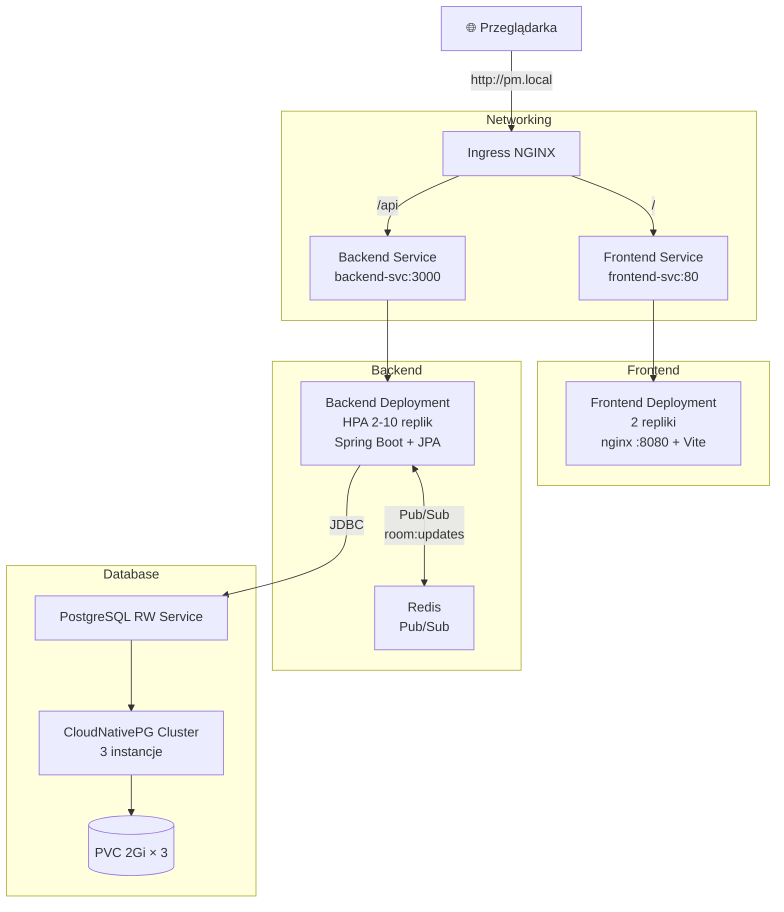

# Państwa Miasta

Multiplayerowa gra słowna wdrożona na Kubernetes przy użyciu Helm.

## Spis treści

- [Funkcjonalności](#funkcjonalności)
- [Architektura](#architektura)
- [Zrzuty ekranu](#zrzuty-ekranu)
- [Struktura projektu](#struktura-projektu)
- [Wymagania](#wymagania)
- [Quick Start](#quick-start)
- [Deployment lokalny (Minikube)](#deployment-lokalny-minikube)
- [Konfiguracja](#konfiguracja)
- [Helm Chart](#helm-chart)
- [API i autoryzacja](#api-i-autoryzacja)
- [PostgreSQL (CloudNativePG)](#postgresql-cloudnativepg)
- [Skalowanie i synchronizacja stanu](#skalowanie-i-synchronizacja-stanu)
- [Observability](#observability)
- [Hardening backendu](#hardening-backendu)
- [Hardening frontendu](#hardening-frontendu)
- [Produkcja](#produkcja)
- [Sekrety](#sekrety)
- [Diagnostyka](#diagnostyka)
- [Ograniczenia](#ograniczenia)

## Funkcjonalności

### Gameplay

- tworzenie publicznych i prywatnych pokoi
- dołączanie przez kod pokoju
- rozgrywka wieloosobowa w czasie rzeczywistym
- głosowanie na odpowiedzi
- automatyczne kończenie rund
- ponowne dołączenie do pokoju po odświeżeniu strony

### Infrastruktura

- JWT bez rejestracji użytkowników
- WebSocket do synchronizacji stanu
- Redis Pub/Sub między replikami backendu
- PostgreSQL CloudNativePG (HA-ready, backup Barman w prod)
- Helm deployment + HPA (2–10 replik backendu)
- Actuator (health, Prometheus) na dedykowanym porcie zarządzania
- Rate limiting create/join (Redis + Bucket4j)
- NetworkPolicies i Pod Security (prod)
- TLS przez cert-manager + Let's Encrypt (prod)
- Obrazy non-root, pinowanie digestów w GHCR (prod)

## Architektura



Frontend komunikuje się z backendem przez **relatywny** prefix `/api` (zob. [`frontend/src/services/api.ts`](frontend/src/services/api.ts)) — ten sam build chodzi za Ingressem niezależnie od hosta.

### Stack technologiczny

| Komponent | Technologia |
| --------- | ----------- |
| Frontend | React 19 + Vite + Tailwind + nginx unprivileged (port 8080) |
| Backend | Spring Boot 4 (Java 21) + Spring Data JPA + Flyway |
| Baza | PostgreSQL 16 (CloudNativePG Cluster, 3 instancje) |
| Redis | redis:7-alpine (dev) / Bitnami Sentinel (prod) |
| Wdrożenie | Helm chart `pm` |
| TLS (prod) | cert-manager + Let's Encrypt |
| Ekspozycja | ingress-nginx, path-based routing |

## Zrzuty ekranu

Pliki umieść w katalogu `docs/screenshots/` (commitowane do repozytorium).

| Ekran | Plik |
| ----- | ---- |
| Strona główna — lobby i lista pokoi | `docs/screenshots/home.png` |
| Pokój — ustawienia i lista graczy | `docs/screenshots/room.png` |
| Gra — runda i formularz odpowiedzi | `docs/screenshots/game.png` |
| Przegląd rund — głosowanie | `docs/screenshots/review.png` |
| Klaster K8s (`kubectl get all -n pm-app`) | `docs/screenshots/k8s-pods.png` |

<!-- Odkomentuj po dodaniu plików PNG:


-->

## Struktura projektu

```
.
├── backend/                          # Spring Boot 4 (Java 21) + JPA + Flyway + JWT + WebSocket
│   ├── src/main/java/com/example/panstwamiasta/
│   │   ├── auth/                     # JWT, filtry, autoryzacja pokoju
│   │   ├── config/                   # Security, Redis, rate limit, ProductionSecretsGuard
│   │   ├── controller/               # REST API (health, rooms)
│   │   ├── dto/                      # Request/response DTO (+ Bean Validation)
│   │   ├── exception/                # GlobalExceptionHandler, typowane wyjątki (404/403/400)
│   │   ├── model/                    # Encje JPA (Player, GameState, RoomSettings)
│   │   ├── repository/               # Spring Data JPA
│   │   ├── room/                     # Encja Room (@Version optimistic locking)
│   │   ├── scheduler/                # Auto-stop rund (roundEndsAt)
│   │   ├── service/                  # Logika pokoi, TTL, broadcast, cleanup
│   │   └── websocket/                # WebSocket handler + rejestr sesji
│   ├── src/main/resources/
│   │   ├── application.properties
│   │   └── db/migration/             # Flyway V1–V3
│   ├── src/test/java/                # Testy (auth, security, kontekst Spring)
│   ├── pom.xml
│   ├── Dockerfile
│   ├── openapi.yaml
│   └── mvnw                          # Maven wrapper
├── frontend/                         # React 19 + Vite + Tailwind + nginx unprivileged
│   ├── src/
│   │   ├── components/
│   │   │   ├── game/                 # AnswerForm, GameHeader, Leaderboard, ReviewPanel
│   │   │   └── room/                 # PlayerList, RoomSettings, LeaveRoomButton
│   │   ├── pages/                    # Home, Room, Game
│   │   ├── hooks/                    # useRoomWebSocket, useWebSocketSync, useGameActions, useGameTimer
│   │   ├── services/                 # api.ts (REST + authFetch), errors.ts (ApiHttpError)
│   │   └── constants/                # game.ts
│   ├── public/                       # favicon, ikony SVG
│   ├── Dockerfile                    # npm ci + multi-stage build
│   ├── nginx.conf                    # CSP, nagłówki bezpieczeństwa, gzip, cache
│   ├── package.json
│   └── package-lock.json
├── helm/pm/                          # Helm chart aplikacji
│   ├── Chart.yaml                    # zależność: Bitnami redis (redisHA, prod)
│   ├── Chart.lock
│   ├── charts/                       # redis-23.1.1.tgz (po helm dependency build)
│   ├── values.yaml                   # domyślne wartości
│   ├── values-minikube.yaml          # override dev (imagePullPolicy: Never)
│   ├── values-prod.yaml              # prod (TLS, Barman, Redis HA, digesty GHCR)
│   └── templates/
│       ├── backend-*.yaml            # Deployment + Service (Actuator :9090)
│       ├── frontend-*.yaml           # Deployment + Service (nginx :8080)
│       ├── postgres-*.yaml           # CNPG Cluster, PDB, backup, legacy StatefulSet
│       ├── redis-*.yaml              # dev: pojedynczy redis:7-alpine
│       ├── networkpolicies.yaml      # default-deny + allow-list (flaga networkPolicy)
│       ├── servicemonitor.yaml       # Prometheus ServiceMonitor (flaga metrics)
│       ├── app-pdb.yaml              # PDB backend/frontend
│       ├── ingress.yaml
│       ├── hpa.yaml
│       ├── configmap.yaml
│       ├── secret.yaml
│       └── namespace.yaml            # etykiety Pod Security Admission
├── scripts/
│   └── create-secrets.sh             # bootstrap sekretów (dev/lab)
├── infra/
│   ├── cert-manager/                 # ClusterIssuery (staging + prod) — poza chartem
│   │   ├── clusterissuer-staging.yaml
│   │   └── clusterissuer-prod.yaml
│   └── sealed-secrets/               # seal.sh + *.sealed.yaml (prod / GitOps)
└── docs/
    └── screenshots/                  # zrzuty ekranu aplikacji i klastra (README)
```

## Wymagania

- Docker
- Minikube >= 1.38
- Helm >= 3.x
- kubectl
- Lokalnie do dev: JDK 21 + Maven (lub `./mvnw`), Node.js 20 i npm dla frontendu (zgodnie z `node:20-alpine` w Dockerfile)

Komendy Helm uruchamiaj z katalogu głównego projektu. Chart podawaj jako **`./helm/pm`** (z `./`) — inaczej Helm interpretuje `helm/pm` jako repozytorium `helm` i chart `pm` → błąd `repo helm not found`.

## Quick Start

Skrócona ścieżka do uruchomienia lokalnego. Pełne szczegóły: [Deployment lokalny (Minikube)](#deployment-lokalny-minikube).

### Start klastra

```bash
minikube start --memory=4096 --cpus=2 --driver=docker
minikube addons enable ingress
minikube addons enable metrics-server

helm repo add cnpg https://cloudnative-pg.github.io/charts
helm upgrade --install cnpg cnpg/cloudnative-pg -n cnpg-system --create-namespace
```

### Build obrazów

```bash
eval $(minikube -p minikube docker-env --shell bash)
docker build -t pm-backend:3.2-auth backend/
docker build -t pm-frontend:1.1-auth frontend/
```

### Deploy

```bash
kubectl create namespace pm-app --dry-run=client -o yaml | kubectl apply -f -

kubectl create secret generic postgres-credentials \
  --from-literal=username=pm --from-literal=password=pmpass \
  --from-literal=POSTGRES_USER=pm --from-literal=POSTGRES_PASSWORD=pmpass \
  --from-literal=POSTGRES_DB=pm \
  -n pm-app --dry-run=client -o yaml | kubectl apply -f -

kubectl create secret generic backend-secrets \
  --from-literal=JWT_SECRET=$(openssl rand -base64 64) \
  -n pm-app --dry-run=client -o yaml | kubectl apply -f -

helm upgrade --install pm ./helm/pm -n pm-app \
  -f helm/pm/values.yaml -f helm/pm/values-minikube.yaml

kubectl wait --for=jsonpath='{.status.phase}'="Cluster in healthy state" \
  cluster/pm-postgres -n pm-app --timeout=300s
kubectl wait --for=condition=Ready pod --all -n pm-app --timeout=180s
```

### Tunnel

```bash
kubectl patch svc ingress-nginx-controller -n ingress-nginx \
  -p '{"spec":{"type":"LoadBalancer"}}'

echo "127.0.0.1 pm.local" | sudo tee -a /etc/hosts
# Windows: C:\Windows\System32\drivers\etc\hosts → 127.0.0.1 pm.local

minikube tunnel   # osobny terminal, proces musi działać cały czas
```

### Otwórz aplikację

<http://pm.local>

Szybka weryfikacja:

```bash
curl http://pm.local/
curl http://pm.local/api/rooms
```

## Deployment lokalny (Minikube)

### Start klastra + addony

```bash
minikube start --memory=4096 --cpus=2 --driver=docker
minikube addons enable ingress
minikube addons enable metrics-server   # wymagane dla HPA i kubectl top
```

### CloudNativePG operator (jednorazowo)

```bash
helm repo add cnpg https://cloudnative-pg.github.io/charts
helm upgrade --install cnpg cnpg/cloudnative-pg -n cnpg-system --create-namespace
```

Na minikube **nie** instaluj pluginu Barman — backupy włączane są tylko w prod ([Produkcja](#produkcja)).

### Build obrazów w demonie minikube

```bash
eval $(minikube -p minikube docker-env --shell bash)
docker build -t pm-backend:3.2-auth backend/
docker build -t pm-frontend:1.1-auth frontend/
```

### Secret Postgres (poza chartem — hasła nie trafiają do git)

Secret musi istnieć **przed** `helm install` — CloudNativePG `Cluster` odwołuje się do `postgres-credentials` przy bootstrap.

```bash
kubectl create namespace pm-app --dry-run=client -o yaml | kubectl apply -f -

kubectl create secret generic postgres-credentials \
  --from-literal=username=pm \
  --from-literal=password=pmpass \
  --from-literal=POSTGRES_USER=pm \
  --from-literal=POSTGRES_PASSWORD=pmpass \
  --from-literal=POSTGRES_DB=pm \
  -n pm-app --dry-run=client -o yaml | kubectl apply -f -
```

Klucze `username`/`password` — wymagane przez CNPG; `POSTGRES_*` — kompatybilność wsteczna.

### Secret JWT (jednorazowo)

```bash
kubectl create secret generic backend-secrets \
  --from-literal=JWT_SECRET=$(openssl rand -base64 64) \
  -n pm-app --dry-run=client -o yaml | kubectl apply -f -
```

> Zamiast tworzyć sekrety pojedynczo, możesz użyć skryptu bootstrap [`scripts/create-secrets.sh`](scripts/create-secrets.sh) (zob. [Sekrety](#sekrety)).

### Wdrożenie Helm chart

Używaj **`helm upgrade --install`** — tworzy release przy pierwszym uruchomieniu i aktualizuje przy kolejnych.

```bash
helm upgrade --install pm ./helm/pm -n pm-app \
  -f helm/pm/values.yaml \
  -f helm/pm/values-minikube.yaml

kubectl wait --for=jsonpath='{.status.phase}'="Cluster in healthy state" \
  cluster/pm-postgres -n pm-app --timeout=300s
kubectl wait --for=condition=Ready pod --all -n pm-app --timeout=180s
kubectl get all,hpa,ingress -n pm-app
helm list -n pm-app
```

Walidacja przed wdrożeniem:

```bash
helm lint ./helm/pm \
  -f helm/pm/values.yaml \
  -f helm/pm/values-minikube.yaml

helm template pm ./helm/pm \
  -f helm/pm/values.yaml \
  -f helm/pm/values-minikube.yaml

helm upgrade --install pm ./helm/pm -n pm-app \
  -f helm/pm/values.yaml \
  -f helm/pm/values-minikube.yaml \
  --dry-run
```

Aktualizacja i rollback:

```bash
helm upgrade --install pm ./helm/pm -n pm-app \
  -f helm/pm/values.yaml \
  -f helm/pm/values-minikube.yaml

helm history pm -n pm-app
helm rollback pm 1 -n pm-app
```

### Patch ingress-nginx-controller na LoadBalancer

`minikube tunnel` przypisuje `EXTERNAL-IP` wyłącznie serwisom typu `LoadBalancer`. Patch jest wymagany jednorazowo po każdym świeżym starcie klastra:

```bash
kubectl patch svc ingress-nginx-controller \
  -n ingress-nginx \
  -p '{"spec":{"type":"LoadBalancer"}}'
```

### Wpis w `/etc/hosts`

```bash
echo "127.0.0.1 pm.local" | sudo tee -a /etc/hosts

# Windows: C:\Windows\System32\drivers\etc\hosts
# 127.0.0.1 pm.local
```

### Uruchomienie tunelu

W **osobnym terminalu** (proces musi działać cały czas):

```bash
minikube tunnel
```

Sprawdzenie:

```bash
kubectl get svc -n ingress-nginx ingress-nginx-controller
# EXTERNAL-IP powinno być 127.0.0.1 gdy tunnel działa
```

Jeśli tunnel nie startuje:

```bash
sudo pkill -f "minikube tunnel"    # zabij wiszący proces
minikube tunnel --cleanup          # opcjonalnie
minikube tunnel                    # ponownie w osobnym terminalu (może wymagać sudo)
```

Typowe przyczyny: stary proces tunelu w tle, brak uprawnień sudo do portów 80/443, uruchomienie tunelu w tym samym terminalu co inne komendy (zamiast osobnego okna).

### Weryfikacja end-to-end

```bash
curl http://pm.local/
curl http://pm.local/api/rooms
curl -X POST -H 'Content-Type: application/json' \
     -d '{"nick":"tester","isPublic":true}' \
     http://pm.local/api/rooms
kubectl exec -n pm-app pm-postgres-1 -- psql -U postgres -d pm -c 'SELECT code, status FROM rooms;'
```

Aplikacja w przeglądarce: <http://pm.local>

### Rebuild po zmianach kodu

Obrazy buduj w **demonie Dockera minikube** (nie w domyślnym Dockerze hosta), z tagami zgodnymi z `helm/pm/values.yaml`:

```bash
eval $(minikube -p minikube docker-env --shell bash)
docker build -t pm-backend:3.2-auth backend/
docker build -t pm-frontend:1.1-auth frontend/
```

Po rebuildzie wymuś restart podów — przy tym samym tagu Kubernetes nie przeładuje obrazu automatycznie (`imagePullPolicy: Never`):

```bash
helm upgrade --install pm ./helm/pm -n pm-app \
  -f helm/pm/values.yaml -f helm/pm/values-minikube.yaml

kubectl rollout restart deployment/frontend deployment/backend -n pm-app
kubectl rollout status deployment/frontend -n pm-app
```

Szybka weryfikacja po zmianach frontendu (nagłówki nginx):

```bash
curl -sI http://pm.local/ | grep -iE "content-security|x-frame|cache-control"
```

### Sprzątanie

```bash
helm uninstall pm -n pm-app
kubectl delete secret postgres-credentials -n pm-app
kubectl delete namespace pm-app
minikube delete
```

### Odtworzenie po restarcie minikube

Po `minikube delete` / restarcie klastra release Helm znika. Pełna sekwencja od nowa: start klastra → CNPG operator → secrety → `helm upgrade --install` → patch Ingress → hosts → tunnel → weryfikacja.

## Konfiguracja

Parametry bazowe: [`helm/pm/values.yaml`](helm/pm/values.yaml). Override minikube: [`helm/pm/values-minikube.yaml`](helm/pm/values-minikube.yaml). Prod + Barman: [`helm/pm/values-prod.yaml`](helm/pm/values-prod.yaml).

|                           | Gdzie                                                                                       | Domyślnie                                              |
| --------------------------- | ------------------------------------------------------------------------------------------- | ------------------------------------------------------ |
| Postgres mode               | `values.yaml` → `postgres.mode`                                                             | `cnpg` (legacy StatefulSet: `legacy`)                  |
| CNPG Cluster                | `values.yaml` → `postgres.cnpg.*`                                                           | `pm-postgres`, 3 instancje, `max_connections: 200`     |
| Flyway baseline (brownfield)| `values-minikube.yaml` → `postgres.flyway.baselineOnMigrate`                                  | `true` jednorazowo, potem `false`                      |
| Hasło Postgres              | Secret `postgres-credentials` (klucze `username`/`password` + `POSTGRES_*`)                 | `pm` / `pmpass` / `pm`                                 |
| Datasource URL              | `configmap.yaml` → `pm.postgres.jdbcUrl`                                                    | `pm-postgres-rw.pm-app.svc...:5432/pm`                 |
| HikariCP pool               | `values.yaml` → `backend.hikari.maximumPoolSize`                                            | 5 (10 podów HPA × 5 = 50 połączeń)                     |
| Rozmiar wolumenu Postgres   | `values.yaml` → `postgres.cnpg.storage`                                                     | 2Gi × 3, `storageClassName: standard`                  |
| Liczba replik frontendu     | `values.yaml` → `frontend.replicas`                                                         | 2                                                      |
| Liczba replik backendu      | `values.yaml` → `backend.replicas` + `hpa.*`                                                | min 2, max 10 (HPA: **tylko CPU** 70%)                 |
| Obrazy Docker               | `values.yaml` → `backend.image`, `frontend.image`                                           | `pm-backend:3.2-auth`, `pm-frontend:1.1-auth`         |
| Rejestr / digest / pull     | `values.yaml` → `global.appImageRegistry`, `image.digest`, `global.imagePullSecrets`        | puste (dev lokalny); prod: GHCR + `@sha256` + `ghcr-pull` |
| imagePullPolicy (minikube)  | `values-minikube.yaml` → `global.imagePullPolicy`                                           | `Never`                                                |
| Routing / host              | `values.yaml` → `ingress.host`                                                             | `pm.local`, `/api` → backend, `/` → frontend           |
| TLS / HTTPS                 | `values.yaml` → `ingress.tls.*` (prod: `values-prod.yaml`)                                  | wyłączone (dev HTTP); prod: cert-manager + `letsencrypt-prod` |
| Redis                       | `values.yaml` → `redis.*` (dev) / `redisHA.*` (prod, Bitnami Sentinel)                       | dev: pojedynczy `redis:7-alpine`; prod: HA Sentinel (3 węzły) |
| Profil Spring / guard       | `values.yaml` → `backend.springProfile` (prod: `values-prod.yaml`)                          | `""` (dev); `prod` aktywuje fail-fast guard na sekretach |
| Sekrety                     | `scripts/create-secrets.sh` (dev) / `infra/sealed-secrets/` (prod)                          | bootstrap kubectl; prod: Sealed Secrets               |
| Pod Security (PSA)          | `values.yaml` → `podSecurity.*`                                                             | enforce `baseline`, warn/audit `restricted`           |
| NetworkPolicies             | `values.yaml` → `networkPolicy.*` (prod: `values-prod.yaml`)                                | wyłączone (dev/minikube); prod: default-deny + allow-list |
| Actuator / port management  | `values.yaml` → `backend.managementPort`                                                    | `9090` (health groups + `/actuator/prometheus`)       |
| Metryki Prometheus          | `values.yaml` → `metrics.serviceMonitor.*`, `metrics.annotations.*` (prod: `values-prod.yaml`) | off (dev); prod: ServiceMonitor                       |
| Logi strukturalne (JSON)    | `values.yaml` → `backend.logging.structuredFormat`                                          | `""` tekst (dev); `ecs` (prod)                         |
| PDB app-tier                | `values.yaml` → `pdb.*`                                                                     | włączone, `maxUnavailable: 1` (backend, frontend)     |
| CORS / WS originy           | `values.yaml` → `backend.cors.allowedOrigins`, `backend.ws.allowedOrigins`                  | `*` (dev); prod: `https://pm.example.com`              |
| Rate limiting (Redis)       | `values.yaml` → `backend.rateLimit.*`                                                       | włączone, 20 req / 60s na IP (create/join)             |
| Graceful shutdown           | `values.yaml` → `backend.terminationGracePeriodSeconds`                                     | 40s + preStop sleep 5                                  |
| Frontend nginx (CSP/headers)| [`frontend/nginx.conf`](frontend/nginx.conf)                                                | CSP, X-Frame-Options, gzip, cache statyków             |
| Frontend auth errors        | [`frontend/src/services/api.ts`](frontend/src/services/api.ts), [`errors.ts`](frontend/src/services/errors.ts) | 401 rejoin+retry, 403 alert                              |

## Helm Chart

Chart [`helm/pm/`](helm/pm/) pakuje wszystkie zasoby Kubernetes aplikacji:

- **Chart.yaml** — metadane chartu (`name: pm`, `version: 0.1.0`); opcjonalna zależność Bitnami `redis` (alias `redisHA`, prod)
- **Chart.lock** + **charts/** — zablokowane wersje subchartów (`redis-23.1.1.tgz` po `helm dependency build`)
- **values.yaml** — domyślne wartości (bez haseł; tylko `postgres.credentialsSecret`)
- **values-minikube.yaml** — override minikube: `imagePullPolicy: Never`, `namespace.create: false`
- **values-prod.yaml** — prod: Barman backup, `primaryUpdateStrategy: supervised`, wyższe resources, TLS (cert-manager), Redis HA
- **templates/** — szablony Go Template generujące manifesty:
  - `backend-deployment.yaml`, `backend-service.yaml` — Spring Boot + HikariCP, JWT secret, probes Actuator na porcie `management` (`9090`)
  - `frontend-deployment.yaml`, `frontend-service.yaml` — nginx unprivileged (port 8080, non-root) + statyczny build Vite
  - `postgres-cluster.yaml`, `postgres-pdb.yaml`, `postgres-objectstore.yaml`, `postgres-scheduledbackup.yaml` — CloudNativePG (tryb `cnpg`)
  - `postgres-statefulset.yaml`, `postgres-service.yaml` — legacy StatefulSet (tryb `legacy`)
  - `redis-deployment.yaml`, `redis-service.yaml` — dev: pojedynczy Redis
  - `networkpolicies.yaml` — default-deny + allow-list (flaga `networkPolicy.enabled`)
  - `servicemonitor.yaml` — Prometheus ServiceMonitor (flaga `metrics.serviceMonitor.enabled`)
  - `app-pdb.yaml` — PDB backend/frontend (flaga `pdb.enabled`)
  - `ingress.yaml`, `hpa.yaml`, `configmap.yaml`, `secret.yaml`, `namespace.yaml` (etykiety PSA), `_helpers.tpl`, `NOTES.txt`

Secret Postgres **nie jest** w repozytorium — tworzony ręcznie przed wdrożeniem. Opcjonalnie `postgres.credentials.create: true` + `--set postgres.credentials.user=... --set postgres.credentials.password=...` tylko na lokalny dev (nie commitować haseł).

Walidacja chartu: `helm lint`, `helm template`, `helm upgrade --install --dry-run`.

## API i autoryzacja

Specyfikacja OpenAPI: [`backend/openapi.yaml`](backend/openapi.yaml).

### Endpointy

- `GET /api/rooms` — lista publicznych pokoi w lobby
- `POST /api/rooms` — utworzenie pokoju (`{nick, isPublic}`)
- `POST /api/rooms/:code/join` — dołączenie do pokoju
- `GET /api/rooms/:code` — pełny stan pokoju (REST fallback; główny sync przez WebSocket)
- `WS /api/ws/rooms/:code` — push stanu pokoju (subscribe + ping/pong)
- `POST /api/rooms/:code/settings` / `/start` / `/stop` / `/answers` / `/vote` / `/next-round` / `/reset` / `/leave`

### JWT (bez konta)

Przy **create/join** backend zwraca `accessToken` (JWT). Klient wysyła `Authorization: Bearer <token>` na chronionych endpointach i `{ type: "subscribe", token }` w WebSocket.

| Endpoint | Auth |
|----------|------|
| `GET /api/health` | publiczny (kompatybilność wsteczna; sondy K8s używają Actuatora na `:9090`) |
| `GET /api/rooms`, `POST /api/rooms`, `POST .../join` | publiczny (wydaje token) |
| Reszta REST + `GET /api/rooms/:code` | Bearer JWT |
| WebSocket subscribe | token w pierwszej wiadomości |

**Rejoin:** nick + kod pokoju → nowy token (istniejący gracz, dowolna faza gry). Nowy nick tylko w lobby.

**Host:** autoryzacja z DB (`is_host`), nie tylko claim JWT.

**Kody HTTP błędów** (spójne odpowiedzi `{ "error": "..." }` z `GlobalExceptionHandler`):

| Kod | Typowe przyczyny |
|-----|------------------|
| 400 | Walidacja Bean Validation, niedozwolona akcja w pokoju |
| 401 | Brak lub nieważny token JWT |
| 403 | Gra już trwa, akcja tylko dla hosta, join w trakcie gry |
| 404 | Pokój nie istnieje |
| 409 | Konflikt optimistic locking (po wyczerpaniu retry) |
| 429 | Rate limit (create/join) |

Deploy auth wymaga **atomowego** rebuild backend + frontend (`3.2-auth` / `1.1-auth`).

## PostgreSQL (CloudNativePG)

Warstwa persystencji — stan pokoi, graczy i gry. Backend łączy się wyłącznie przez JDBC; schemat zarządza Flyway przy starcie.

### Architektura

Baza działa jako **CloudNativePG `Cluster`** (`pm-postgres`, 3 instancje = quorum). Backend łączy się przez serwis **`pm-postgres-rw`**. PDB (`maxUnavailable: 1`) chroni przed jednoczesnym evictem wielu instancji przy `kubectl drain`.

### Migracja StatefulSet → CNPG

PVC `postgres-data-postgres-0` **nie jest** adoptowany przez CNPG.

1. `pg_dump` ze starego `postgres-0` (przed usunięciem StatefulSet)
2. `helm upgrade` z `postgres.mode=cnpg`
3. Poczekaj: `kubectl wait --for=jsonpath='{.status.phase}'="Cluster in healthy state" cluster/pm-postgres -n pm-app --timeout=300s`
4. `pg_restore` do `pm-postgres-rw`

### Flyway

Schemat zarządza **Flyway** przy starcie backendu (`spring-boot-starter-flyway` + `flyway-database-postgresql`). Hibernate: `ddl-auto=validate` — nie modyfikuje schematu.

Migracje: [`backend/src/main/resources/db/migration/`](backend/src/main/resources/db/migration/)

| Plik | Opis |
|------|------|
| `V1__initial_schema.sql` | Pełny schemat (świeże bazy) |
| `V2__players_fk_cascade.sql` | Idempotentny fix FK CASCADE (brownfield) |
| `V3__rooms_optimistic_lock.sql` | Kolumna `version` dla optimistic locking |

**Nowa migracja:** dodaj `V4__opis.sql`, rebuild backendu, restart deploymentu.

**Brownfield** (baza CNPG utworzona przez stary `ddl-auto=update`, bez `flyway_schema_history`):

1. W [`values-minikube.yaml`](helm/pm/values-minikube.yaml): `postgres.flyway.baselineOnMigrate: true`
2. `helm upgrade` + restart backendu → baseline v1 + uruchomienie V2
3. Po sukcesie ustaw z powrotem `baselineOnMigrate: false`

**Lokalny test (przed docker build):**

```bash
docker run --rm -d --name pm-pg-test -e POSTGRES_DB=pm -e POSTGRES_USER=pm \
  -e POSTGRES_PASSWORD=pmpass -p 5432:5432 postgres:16
docker run --rm -d --name pm-redis-test -p 6379:6379 redis:7-alpine
cd backend
export SPRING_DATASOURCE_URL=jdbc:postgresql://localhost:5432/pm
export SPRING_DATASOURCE_USERNAME=pm SPRING_DATASOURCE_PASSWORD=pmpass
export FLYWAY_BASELINE_ON_MIGRATE=false
./mvnw spring-boot:run
```

### Backupy Barman

```bash
helm upgrade --install cnpg-plugin-barman-cloud cnpg/plugin-barman-cloud -n cnpg-system
kubectl create secret generic pm-postgres-s3-credentials \
  --from-literal=ACCESS_KEY_ID=... --from-literal=SECRET_ACCESS_KEY=... -n pm-app
helm upgrade --install pm ./helm/pm -n pm-app \
  -f helm/pm/values.yaml -f helm/pm/values-prod.yaml \
  --set postgres.cnpg.backup.destinationPath=s3://YOUR-BUCKET/pm-postgres/
```

### Failover

```bash
PRIMARY=$(kubectl get cluster pm-postgres -n pm-app -o jsonpath='{.status.currentPrimary}')
kubectl exec -n pm-app "$PRIMARY" -- \
  psql -U postgres -d pm -c "SELECT application_name, state, sent_lsn, write_lsn FROM pg_stat_replication;"
kubectl delete pod "$PRIMARY" -n pm-app
kubectl wait --for=jsonpath='{.status.phase}'="Cluster in healthy state" \
  cluster/pm-postgres -n pm-app --timeout=120s
kubectl get cluster pm-postgres -n pm-app -o jsonpath='New primary: {.status.currentPrimary}{"\n"}'
curl http://pm.local/api/rooms
```

## Skalowanie i synchronizacja stanu

Redis, WebSocket i HPA budują na warstwie API i PostgreSQL — synchronizują stan między replikami backendu i skalują obciążenie, podczas gdy źródłem prawdy pozostaje baza.

Stan pokoju (lobby + gra) synchronizowany jest przez **WebSocket** (`/api/ws/rooms/{code}`). Główny hook UI to [`useRoomWebSocket.ts`](frontend/src/hooks/useRoomWebSocket.ts) (składa [`useWebSocketSync`](frontend/src/hooks/useWebSocketSync.ts) — sync WS + rejoin, [`useGameActions`](frontend/src/hooks/useGameActions.ts) — mutacje REST, [`useGameTimer`](frontend/src/hooks/useGameTimer.ts) — odliczanie). Mutacje (start, stop, głosowanie) idą przez REST. Lista publicznych pokoi na stronie głównej używa REST co 3s.

### WebSocket

Każda replika backendu utrzymuje własny rejestr sesji WebSocket. Po mutacji REST backend publikuje kod pokoju do Redis Pub/Sub; replika z subskrybentami pushuje świeży stan do klientów WS. `mainTimeLeft` liczone dynamicznie przy pushu; frontend odlicza lokalnie między pushami.

### Redis Pub/Sub

Kanał `room:updates` synchronizuje stan między replikami backendu. Dev: pojedynczy `redis:7-alpine` (`redis.enabled`) wystarczy na lab; restart Redisa zrywa subskrypcje Pub/Sub (klienci WS reconnectują). Prod: HA z Sentinelem (zob. [Produkcja → Redis HA](#redis-ha)).

Redis obsługuje też TTL pokoi i keyspace notifications (`__keyevent@0__:expired`) — wymaga `notify-keyspace-events Ex` w chart Helm.

### HPA

Włączony w chart (`hpa.enabled: true`). Wymaga addonu `metrics-server`.

Skaluje backend **tylko po CPU** (`hpa.cpu.enabled: true`, cel 70%). Metryka pamięci jest **wyłączona** (`hpa.memory.enabled: false`) — JVM (Spring Boot) utrzymuje stały, wysoki footprint RAM niezależnie od ruchu; przy włączonej metryce pamięci HPA fałszywie skalował w górę do `maxReplicas` nawet przy `cpu: 1%`.

Zakres: min 2, max 10 replik. HPA pokazuje `cpu: <unknown>/70%` przez 1–2 minuty po starcie — metrics-server potrzebuje czasu na zebranie metryk z nowych podów.

### Auto-stop rund

Czas trwania rundy jest przechowywany jako `game.roundEndsAt` (Unix ms) w PostgreSQL. Scheduler co 1s sprawdza **tylko pokoje z aktywnymi subskrypcjami WebSocket** na danym podzie i wykonuje atomowy `UPDATE`:

```sql
UPDATE rooms SET status = 'reviewing'
WHERE code = :code AND status = 'playing' AND round_ends_at <= :now
```

Dzięki temu backend można skalować (HPA 2–10 replik) bez podwójnego auto-stopu.

### Cleanup pokoi (TTL) i wyjście

- **`POST /api/rooms/{code}/leave`** — gracz opuszcza pokój w dowolnej fazie; ostatni gracz kasuje pokój od razu.
- Gdy **nikt nie ma aktywnego WebSocket** w pokoju, Redis ustawia TTL: **3 min** (lobby/finished) lub **10 min** (playing/reviewing) — czas na reconnect po zamknięciu karty / F5.
- Ponowne **subscribe WS** anuluje TTL; po wygaśnięciu klucza pokój jest usuwany z Postgres.
- Konfiguracja: `APP_ROOM_TTL_LOBBY_SECONDS`, `APP_ROOM_TTL_IN_GAME_SECONDS` w ConfigMap (domyślnie 180 / 600).
- Event `expired` może przyjść z lekkim opóźnieniem (lazy expiration).

## Observability

Backend wystawia **Spring Boot Actuator** na **dedykowanym porcie zarządzania `9090`** (osobny od portu aplikacji `3000`, poza routingiem ingress — nieosiągalny publicznie). Endpointy: `health`, `info`, `prometheus`.

**Health groups (deep health + probes).** `management.endpoint.health.probes.enabled=true` daje dwie grupy:

- `/actuator/health/liveness` — płytka (`livenessState`); blip bazy/Redisa **nie** zabija poda.
- `/actuator/health/readiness` — głęboka (`readinessState` + `db` + `redis`); gdy baza lub Redis są niedostępne, pod wychodzi z rotacji Service.

Probes Kubernetes ([`backend-deployment.yaml`](helm/pm/templates/backend-deployment.yaml)) celują w port `management`:

- `startupProbe` → `/actuator/health/liveness` (`failureThreshold: 30 × 5s` = do ~150s na start JVM/Flyway; zastępuje długie `initialDelaySeconds`),
- `livenessProbe` → `/actuator/health/liveness`,
- `readinessProbe` → `/actuator/health/readiness`.

Endpoint `/api/health` zostaje dla kompatybilności wstecznej. Dostęp do Actuatora jest jawnie `permitAll()` w `SecurityConfig` (`EndpointRequest.toAnyEndpoint()`).

**Metryki Prometheus.** `/actuator/prometheus` (Micrometer). Dwa niezależne, domyślnie wyłączone mechanizmy (`metrics.*`):

- `metrics.serviceMonitor.enabled` → `ServiceMonitor` (CRD `monitoring.coreos.com/v1`, wymaga Prometheus Operatora; ustaw `metrics.serviceMonitor.labels` pod swój release Prometheusa),
- `metrics.annotations.enabled` → adnotacje `prometheus.io/scrape|port|path` na podzie (Prometheus bez operatora).

Gdy którykolwiek jest włączony, polityka sieciowa backendu otwiera port `9090` dla namespace monitoringu (`networkPolicy.monitoringNamespace`).

**Logi.** Strukturalne logi JSON sterowane `backend.logging.structuredFormat` (puste = czytelny tekst w dev; `ecs` w prod). Wbudowane w Spring Boot (`logging.structured.format.console`), wypisywane na stdout — zbiera je kolektor (Loki/ELK/Fluent Bit).

**Dostępność (PDB app-tier).** [`app-pdb.yaml`](helm/pm/templates/app-pdb.yaml) (`pdb.enabled`, domyślnie `true`) tworzy PDB dla `backend` i `frontend` (`maxUnavailable: 1`), chroniąc przed jednoczesnym ubytkiem wszystkich replik podczas drenażu węzłów. CNPG i Redis HA mają własne PDB.

## Hardening backendu

Warstwa API została utwardzona pod kątem produkcji:

**Globalna obsługa błędów.** `@RestControllerAdvice` (`GlobalExceptionHandler`) mapuje typowane wyjątki na spójne odpowiedzi `ApiError` (pole `error` — kompatybilność z frontem):
- `RoomNotFoundException` → 404,
- `GameAlreadyStartedException` → 403,
- `InvalidRoomActionException` → 400,
- błędy walidacji Bean Validation → 400,
- `OptimisticLockingFailureException` (po wyczerpaniu retry) → 409,
- nieobsłużone → 500 (bez wycieku stacktrace).

Kontroler nie zawiera już bloków `try/catch` ani ręcznego sprawdzania nicka.

**Optimistic locking.** Encja `Room` ma `@Version`; migracja Flyway `V3__rooms_optimistic_lock.sql` dodaje kolumnę `version`. Mutujące metody `RoomService` mają `@Retryable` (max 3 próby, backoff 50 ms) — konflikt wersji jest przezroczysty dla klienta.

**Walidacja wejścia.** Bean Validation na DTO (`@NotBlank`, `@Size`, `@Min`/`@Max`) + `@Valid` w kontrolerze. Nick max 30 znaków; ustawienia pokoju mają sensowne limity (rundy 1–20, gracze 2–16 itd.).

**Rate limiting (Redis).** Bucket4j + Lettuce, rozproszony przez Redis (standalone dev / Sentinel prod). Dotyczy publicznych `POST /api/rooms` i `POST /api/rooms/{code}/join`; klucz = IP z `X-Forwarded-For`. Przekroczenie limitu → 429 `Too many requests`. Konfiguracja: `backend.rateLimit.*` (`capacity`, `refillPeriodSeconds`, `enabled`).

**Graceful shutdown.** `server.shutdown=graceful` + `spring.lifecycle.timeout-per-shutdown-phase=30s`; w K8s `terminationGracePeriodSeconds: 40` i `preStop sleep 5` na deregistrację endpointów przed zamknięciem JVM.

**Originy CORS/WebSocket.** Zamiast twardego `*`: `backend.cors.allowedOrigins` (HTTP API) i `backend.ws.allowedOrigins` (WebSocket). Dev: `*`; prod: `https://pm.example.com` (PODMIEŃ na właściwą domenę).

## Hardening frontendu

Warstwa statyczna (nginx) i klient API zostały utwardzone:

**Nagłówki nginx + CSP.** [`frontend/nginx.conf`](frontend/nginx.conf) dodaje: `X-Content-Type-Options`, `X-Frame-Options`, `Referrer-Policy`, `Permissions-Policy`, `Content-Security-Policy` (`connect-src 'self' ws: wss:` dla REST i WebSocket na tym samym hoście). HSTS pozostaje na ingress (TLS). Gzip dla JS/CSS/JSON/SVG; cache `immutable` (1 rok) dla hashowanych statyków Vite; `index.html` z `Cache-Control: no-cache`. Nagłówki bezpieczeństwa są powtórzone w `location` z własnymi regułami cache — nginx nie dziedziczy `add_header` z bloku `server`.

**npm ci.** Dockerfile używa `npm ci` z `package-lock.json` — deterministyczny build obrazu.

**Obsługa 401/403.** [`frontend/src/services/api.ts`](frontend/src/services/api.ts) + [`errors.ts`](frontend/src/services/errors.ts) (`ApiHttpError`):
- **401** na endpointach chronionych: wyczyść sesję → `ensureSession` (rejoin nick+kod) → jeden retry; przy trwałym braku sesji → redirect na `/`.
- **403** (np. gość próbuje startu, join do trwającej gry): `alert` z komunikatem backendu, sesja zostaje.
- Publiczne `create`/`join` parsują kody HTTP (404, 400, 403) zamiast pola `error` w 200.

Po zmianie nginx trzeba przebudować obraz frontendu i (prod) odświeżyć digest w `values-prod.yaml`.

## Produkcja

### TLS / cert-manager

Na produkcji Ingress terminuje TLS, a certyfikat wystawia **cert-manager** (Let's Encrypt, HTTP-01). Lokalny dev (`values-minikube.yaml`) zostaje na czystym HTTP (`tls.enabled: false`).

Włączenie sterowane wartościami `ingress.tls.*` (zob. [`helm/pm/values.yaml`](helm/pm/values.yaml), prod: [`helm/pm/values-prod.yaml`](helm/pm/values-prod.yaml)):

| Klucz | Opis |
|-------|------|
| `ingress.tls.enabled` | dodaje blok `spec.tls`, annotację `cert-manager.io/cluster-issuer` i `ssl-redirect` |
| `ingress.tls.secretName` | nazwa Secreta na certyfikat (tworzony przez cert-manager), domyślnie `pm-tls` |
| `ingress.tls.clusterIssuer` | nazwa `ClusterIssuer`, np. `letsencrypt-prod` |
| `ingress.tls.sslRedirect` | wymuszenie HTTP → HTTPS (`true`) |

Instalacja cert-manager (jednorazowo):

```bash
helm repo add jetstack https://charts.jetstack.io
helm repo update
helm install cert-manager jetstack/cert-manager \
  -n cert-manager --create-namespace --set crds.enabled=true
kubectl get pods -n cert-manager
```

ClusterIssuery — manifesty w [`infra/cert-manager/`](infra/cert-manager/). Podmień `email`, potem zaaplikuj. Najpierw **staging**, po sukcesie **prod**:

```bash
kubectl apply -f infra/cert-manager/clusterissuer-staging.yaml
kubectl apply -f infra/cert-manager/clusterissuer-prod.yaml
kubectl get clusterissuer
```

DNS + deploy prod:

```bash
kubectl get svc -n ingress-nginx ingress-nginx-controller
helm upgrade --install pm ./helm/pm -n pm-app \
  -f helm/pm/values.yaml -f helm/pm/values-prod.yaml
```

cert-manager automatycznie wykryje annotację na Ingressie, przeprowadzi challenge HTTP-01 i zapisze certyfikat do Secreta `pm-tls`.

Weryfikacja:

```bash
kubectl get certificate -n pm-app
curl -I https://pm.example.com/api/health    # 200; http -> 308 redirect na https
```

### Container Registry (GHCR)

Lokalny dev (minikube) buduje obrazy w demonie Dockera klastra (`imagePullPolicy: Never`, pusty `global.appImageRegistry`). Na produkcji obrazy backend/frontend pochodzą z prywatnego rejestru (przykład: GHCR), są **pinowane po digest** (`@sha256:...`) i pobierane przez `imagePullSecrets`. Konfiguracja w [`helm/pm/values-prod.yaml`](helm/pm/values-prod.yaml):

| Klucz | Opis |
|-------|------|
| `global.appImageRegistry` | prefiks rejestru obrazów aplikacji, np. `ghcr.io/OWNER` (puste = obraz lokalny) |
| `backend.image.digest` / `frontend.image.digest` | `sha256:...`; ustawiony ma priorytet nad `tag` |
| `global.imagePullSecrets` | lista nazw Secretów typu `docker-registry` |

Build + push:

```bash
docker build -t ghcr.io/OWNER/pm-backend:3.2-auth backend/
docker build -t ghcr.io/OWNER/pm-frontend:1.1-auth frontend/
docker push ghcr.io/OWNER/pm-backend:3.2-auth
docker push ghcr.io/OWNER/pm-frontend:1.1-auth
```

Pobranie digestu (do `values-prod.yaml`):

```bash
docker buildx imagetools inspect ghcr.io/OWNER/pm-backend:3.2-auth \
  --format '{{ "{{json .Manifest.Digest}}" }}'
docker buildx imagetools inspect ghcr.io/OWNER/pm-frontend:1.1-auth \
  --format '{{ "{{json .Manifest.Digest}}" }}'
# wynik: "sha256:..." -> wpisz jako backend.image.digest / frontend.image.digest
```

Po aktualizacji digestów w `values-prod.yaml`:

```bash
helm upgrade --install pm ./helm/pm -n pm-app \
  -f helm/pm/values.yaml -f helm/pm/values-prod.yaml
kubectl rollout status deployment/backend deployment/frontend -n pm-app
```

imagePullSecret (jednorazowo):

```bash
kubectl create secret docker-registry ghcr-pull \
  --docker-server=ghcr.io \
  --docker-username=GH_USER \
  --docker-password=GH_TOKEN \
  -n pm-app
```

### Redis HA

Dev używa pojedynczego `redis:7-alpine` (`redis.enabled: true`). Produkcja używa subchartu **Bitnami Redis** w trybie replication + **Sentinel** (`redisHA.enabled: true`, `redis.enabled: false` w [`values-prod.yaml`](helm/pm/values-prod.yaml)): 3 węzły (1 master + 2 repliki), automatyczny failover, AOF persistence, PDB i auth. Tryby wykluczają się wzajemnie.

Backend łączy się przez Sentinel wyłącznie konfiguracją (`spring.data.redis.sentinel.*` ze zmiennych env) — Lettuce jest już w zależnościach, więc **bez zmian w kodzie i bez rebuildu**. Zachowane: Pub/Sub `room:updates`, keyspace `__keyevent@0__:expired`, Lua/liczniki (zapisy routowane na master).

| Klucz | Opis |
|-------|------|
| `redisHA.sentinel.masterSet` | nazwa zbioru mastera (`mymaster`) |
| `redisHA.sentinel.quorum` | quorum Sentinela (`2`) |
| `redisHA.replica.replicaCount` | liczba węzłów (`3`) |
| `redisHA.replica.persistence` / `master.persistence` | AOF PVC (`1Gi`, `storageClass: standard`) |
| `redisHA.replica.pdb` | PodDisruptionBudget (`maxUnavailable: 1`) |
| `redisHA.auth.existingSecret` | sekret z hasłem (`redis-credentials`, klucz `redis-password`) |

Sekret z hasłem (jednorazowo):

```bash
kubectl create secret generic redis-credentials \
  --from-literal=redis-password=$(openssl rand -base64 24) \
  -n pm-app --dry-run=client -o yaml | kubectl apply -f -
```

Pobranie subchartu i deploy:

```bash
helm dependency build helm/pm          # pobiera Bitnami redis do helm/pm/charts/
helm upgrade --install pm ./helm/pm -n pm-app \
  -f helm/pm/values.yaml -f helm/pm/values-prod.yaml
kubectl get statefulset,pdb,svc -n pm-app -l app.kubernetes.io/name=redis
```

Test failover:

```bash
kubectl delete pod pm-redis-node-0 -n pm-app
kubectl logs -n pm-app deploy/backend -f | grep -i "sentinel\|master"
```

> Uwaga o obrazach Bitnami: od 2025 część publicznych obrazów Bitnami przeniesiono (model "Bitnami Secure Images"). Jeśli pull `bitnami/redis` zawiedzie, nadpisz `redisHA.image.registry`/`redisHA.image.repository` (np. `bitnamilegacy`) lub własny mirror.

### Bezpieczeństwo: NetworkPolicies + Pod Security + non-root

Trzy warstwy hardeningu warstwy aplikacji (backend/frontend), domyślnie bezpieczne dla dev:

**Obrazy non-root.** Backend (`eclipse-temurin`) dostaje użytkownika `USER 10001`; frontend używa bazy `nginxinc/nginx-unprivileged` i nasłuchuje na **porcie 8080** (zamiast 80). Po tej zmianie obrazy trzeba przebudować, a w prod wygenerować nowe digesty (`backend.image.digest`, `frontend.image.digest` w `values-prod.yaml`).

```bash
# minikube (demon dockera minikube)
eval $(minikube -p minikube docker-env --shell bash)
docker build -t pm-backend:3.2-auth backend/
docker build -t pm-frontend:1.1-auth frontend/
# prod (GHCR) — po push odczytaj digest i wpisz do values-prod.yaml
docker buildx imagetools inspect ghcr.io/OWNER/pm-frontend:1.1-auth --format '{{ "{{" }}.Manifest.Digest{{ "}}" }}'
```

**securityContext (restricted).** Każdy pod app-tier startuje jako non-root z `seccompProfile: RuntimeDefault`, `allowPrivilegeEscalation: false`, `capabilities.drop: [ALL]`. Backend ma dodatkowo `readOnlyRootFilesystem: true` z `emptyDir` zamontowanym na `/tmp` (JVM). Parametry w `backend.podSecurityContext`/`backend.containerSecurityContext` i odpowiednikach `frontend.*`.

**Pod Security Admission (PSA).** Namespace dostaje etykiety `pod-security.kubernetes.io/{enforce,warn,audit}`. Domyślnie `enforce: baseline` (bezpieczne dla podów CNPG i Bitnami Redis), a `restricted` leci jako `warn`/`audit` — czyli ostrzeżenia bez blokowania. Konfiguracja w `podSecurity.*`. Gdy `namespace.create: false` (minikube), etykiety trzeba nałożyć ręcznie:

```bash
kubectl label ns pm-app \
  pod-security.kubernetes.io/enforce=baseline \
  pod-security.kubernetes.io/warn=restricted \
  pod-security.kubernetes.io/audit=restricted --overwrite
```

**NetworkPolicies (default-deny + allow-list).** Włączane flagą `networkPolicy.enabled` (prod: `true`). Polityka `default-deny` blokuje cały ruch, a kolejne reguły otwierają tylko:

- DNS (wszystkie pody → kube-dns),
- frontend ← kontroler ingress (`:8080`),
- backend ← kontroler ingress (`:3000`), backend → Postgres (`:5432`) i Redis (`:6379`/`:26379`),
- CNPG ← backend + replikacja wewnątrz klastra + operator (`networkPolicy.cnpgOperatorNamespace`),
- Redis ← backend + (HA) ruch Sentinel wewnątrz klastra.

Namespace kontrolera ingress dopasowywany etykietą `kubernetes.io/metadata.name` (`networkPolicy.ingressNamespace`, domyślnie `ingress-nginx`).

> Uwaga: NetworkPolicy egzekwuje dopiero CNI je wspierające. Domyślny CNI minikube ich **nie** egzekwuje — uruchom klaster z `minikube start --cni=calico`, by polityki działały. Stąd flaga domyślnie wyłączona dla dev.

## Sekrety

Aplikacja używa sekretów: `postgres-credentials`, `backend-secrets` (`JWT_SECRET`), `redis-credentials` (tylko gdy Redis ma auth), `ghcr-pull` (pull obrazów), `pm-postgres-s3-credentials` (backup Barman). Żaden plaintext nie trafia do repo.

### Fail-fast guard na domyślnych sekretach

[`ProductionSecretsGuard`](backend/src/main/java/com/example/panstwamiasta/config/ProductionSecretsGuard.java) jest aktywny pod profilem Spring **`prod`** (ustawianym przez `backend.springProfile: prod` w [`values-prod.yaml`](helm/pm/values-prod.yaml) → `SPRING_PROFILES_ACTIVE`). Przerywa start poda, jeśli wykryje:

- `app.jwt.secret` równy wbudowanemu defaultowi dev,
- `spring.datasource.password` pusty lub znany default (`postgres`, `pmpass`).

Dev/minikube (`backend.springProfile: ""`) działa dalej na defaultach — guard jest nieaktywny.

### Bootstrap (dev / lab)

[`scripts/create-secrets.sh`](scripts/create-secrets.sh) tworzy wszystkie sekrety idempotentnie (`kubectl apply` z dry-run):

```bash
PG_USER=pm PG_PASSWORD='...' \
  ./scripts/create-secrets.sh
# opcjonalnie:
#   REDIS_AUTH=true REDIS_PASSWORD='...'        - gdy Redis ma auth (redisHA)
#   GITHUB_TOKEN=... GITHUB_USER=...            - ghcr-pull
#   S3_ACCESS_KEY_ID=... S3_SECRET_ACCESS_KEY=... - backup Barman
```

### Sealed Secrets (produkcja / GitOps)

Na produkcji preferuj **Sealed Secrets** — zaszyfrowane `*.sealed.yaml` można bezpiecznie trzymać w git, a kontroler w klastrze odszyfrowuje je do natywnych Secretów.

```bash
# 1. Kontroler w klastrze (jednorazowo)
helm repo add sealed-secrets https://bitnami-labs.github.io/sealed-secrets
helm install sealed-secrets sealed-secrets/sealed-secrets -n kube-system

# 2. CLI kubeseal: https://github.com/bitnami-labs/sealed-secrets#kubeseal

# 3. Wygeneruj zaszyfrowane manifesty (plaintext z env, nie z repo)
JWT_SECRET='...' PG_USER=pm PG_PASSWORD='...' REDIS_PASSWORD='...' \
  ./infra/sealed-secrets/seal.sh

# 4. Zacommituj i zaaplikuj
kubectl apply -f infra/sealed-secrets/
```

### Backupy

Backupy PostgreSQL (Barman PITR) opisane w sekcji [PostgreSQL → Backupy Barman](#backupy-barman). Wymagają pluginu `cnpg-plugin-barman-cloud` i sekretu S3 — włączane wyłącznie przez `values-prod.yaml`.

## Diagnostyka

### Kubernetes

```bash
kubectl get all,pvc,ingress,hpa -n pm-app
kubectl logs -n pm-app deploy/backend -f
kubectl top pod -n pm-app
kubectl port-forward -n pm-app svc/backend-svc 3000:3000   # API aplikacji
kubectl port-forward -n pm-app deploy/backend 9090:9090    # Actuator (health, prometheus)
```

### Helm

```bash
helm status pm -n pm-app
helm list -n pm-app
helm history pm -n pm-app
```

### HPA

```bash
kubectl describe hpa backend-hpa -n pm-app
kubectl get hpa backend-hpa -n pm-app -w
kubectl top pod -n pm-app -l app=backend

# test obciążeniowy (skalowanie w górę po CPU)
kubectl run loadgen --image=busybox:1.36 --restart=Never -n pm-app -- \
  sh -c 'while true; do wget -q -O- http://backend-svc:3000/api/rooms; done'
kubectl delete pod loadgen -n pm-app   # po teście — HPA stopniowo wraca do min. 2
```

### PostgreSQL

```bash
kubectl get cluster pm-postgres -n pm-app
kubectl exec -n pm-app pm-postgres-1 -- psql -U postgres -d pm -c 'SELECT code, status FROM rooms;'
PRIMARY=$(kubectl get cluster pm-postgres -n pm-app -o jsonpath='{.status.currentPrimary}')
kubectl exec -n pm-app "$PRIMARY" -- \
  psql -U postgres -d pm -c "SELECT application_name, state FROM pg_stat_replication;"
```

### TLS

Najczęstszy problem przy Let's Encrypt: challenge wisi w `pending`, bo DNS nie wskazuje na IP Ingressu.

```bash
kubectl get certificate -n pm-app
kubectl describe certificate pm-tls -n pm-app
kubectl get challenge -n pm-app
nslookup pm.example.com
kubectl get svc -n ingress-nginx ingress-nginx-controller
```

## Ograniczenia

- **CloudNativePG PVC**: każda instancja ma własny PVC; `helm uninstall` nie usuwa PVC domyślnie.
- **Flyway brownfield**: jednorazowo `postgres.flyway.baselineOnMigrate: true` w values-minikube; potem wyłącz.
- **Pierwszy start backendu** jest wolniejszy (JVM + Flyway + Hibernate validate) — `startupProbe` daje do ~150s na start zanim liveness zacznie restartować pod.
- **`helm upgrade` bez release**: samo `helm upgrade` failuje, gdy release nie istnieje — używaj `helm upgrade --install`.
