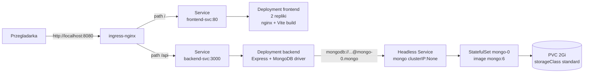

# Państwa Miasta

Multiplayerowa gra słowna "Państwa Miasta" wdrożona na lokalnym klastrze Kubernetes z wykorzystaniem `minikube`. Projekt zbudowany według wzorców z Laboratoriów 2-5 oraz 8 (`lab/`).

## Architektura



Wszystko żyje w namespace `stop-app`.

| Komponent  | Technologia                           | Folder           | Lab                    |
| ---------- | ------------------------------------- | ---------------- | ---------------------- |
| Frontend   | React 19 + Vite + Tailwind + nginx    | `frontend/`      | Lab 2, 8               |
| Backend    | Express 5 + driver `mongodb`          | `backendTest/`   | Lab 2, 5, 8            |
| Baza       | MongoDB 6 (StatefulSet + PVC)         | -                | Lab 4, 5               |
| Ekspozycja | ingress-nginx, path-based             | `k8s/40-ingress` | Lab 3                  |

Frontend komunikuje się z backendem przez **relatywny** prefix `/api` (zob. [`frontend/src/services/api.ts`](frontend/src/services/api.ts)) — ten sam build chodzi za Ingressem niezależnie od hosta.

## Struktura repo

```
.
├── backendTest/        # Express + Mongo
│   ├── index.js
│   ├── package.json
│   ├── Dockerfile
│   └── openapi.yaml    # specyfikacja API
├── frontend/           # React/Vite + nginx
│   ├── src/
│   ├── Dockerfile      # multi-stage: node build -> nginx serve
│   └── nginx.conf      # SPA fallback (try_files ... /index.html)
├── k8s/                # manifesty Kubernetes (Lab 2-5 + 8)
│   ├── 00-namespace.yaml
│   ├── 10-mongo-secret.yaml
│   ├── 11-mongo-headless-service.yaml
│   ├── 12-mongo-statefulset.yaml
│   ├── 20-backend-configmap.yaml
│   ├── 21-backend-deployment.yaml
│   ├── 22-backend-service.yaml
│   ├── 30-frontend-deployment.yaml
│   ├── 31-frontend-service.yaml
│   └── 40-ingress.yaml
└── lab/                # instrukcje laboratoryjne (PDF)
```

## Wymagania

- `minikube` >= 1.38, `kubectl`, Docker (na WSL2 wystarcza Docker Desktop)
- Lokalnie do dev: Node.js 18+, npm

## Uruchomienie w minikube

### 1. Start klastra + addon Ingress

```bash
minikube start --memory=4096 --cpus=2 --driver=docker
minikube addons enable ingress
```

### 2. Build obrazów w demonie minikube

Dzięki temu Kubernetes znajduje obrazy lokalnie i nie próbuje ich ściągać z rejestru (manifesty mają `imagePullPolicy: Never`).

```bash
eval $(minikube -p minikube docker-env --shell bash)
docker build -t stop-backend:1.0 backendTest/
docker build -t stop-frontend:1.0 frontend/
```

### 3. Apply manifestów

```bash
kubectl apply -f k8s/
kubectl wait --for=condition=Ready pod --all -n stop-app --timeout=180s
kubectl get all,pvc,ingress -n stop-app
```

### 4. Dostęp do aplikacji

Na WSL2 z driverem `docker` `minikube ip` (`192.168.49.2`) nie jest routowalne z hosta. Najprostszy sposób to port-forward kontrolera Ingress na localhost:

```bash
kubectl port-forward -n ingress-nginx svc/ingress-nginx-controller 8080:80
```

Aplikacja: <http://localhost:8080/>, API: <http://localhost:8080/api/rooms>.

Alternatywa: `minikube tunnel` (osobny terminal, wymaga sudo) + wpis `$(minikube ip) stop.local` w `/etc/hosts`. Wymagałoby też przywrócenia `host: stop.local` w [`k8s/40-ingress.yaml`](k8s/40-ingress.yaml) — w obecnej wersji Ingress jest catch-all (zob. Laboratorium 3, wariant path-based bez `host:`).

### 5. Weryfikacja end-to-end

```bash
curl http://localhost:8080/                                                # frontend -> 200
curl http://localhost:8080/api/rooms                                       # backend -> []
curl -X POST -H 'Content-Type: application/json' \
     -d '{"nick":"tester","isPublic":true}' \
     http://localhost:8080/api/rooms                                       # backend -> {code, playerId}
curl http://localhost:8080/api/rooms                                       # zwraca utworzony pokoj
kubectl exec -n stop-app mongo-0 -- mongosh -u admin -p adminpass \
     --authenticationDatabase admin --quiet \
     --eval 'db.getSiblingDB("stop").rooms.find({}).toArray()'             # dokument w bazie
```

### Komendy diagnostyczne (Lab 2 + 8)

```bash
kubectl get all,pvc,ingress -n stop-app
kubectl logs -n stop-app deploy/backend -f
kubectl logs -n stop-app statefulset/mongo
kubectl describe pod -n stop-app mongo-0
kubectl exec -it -n stop-app mongo-0 -- mongosh -u admin -p adminpass
kubectl top pod -n stop-app                  # wymaga `minikube addons enable metrics-server`
kubectl port-forward -n stop-app svc/backend-svc 3000:3000   # debug API bez Ingressa
```

### Sprzątanie

```bash
kubectl delete -f k8s/
minikube delete
```

## Konfiguracja

Tabelka rzeczy, które mogą się chcieć zmienić.

| Co                          | Gdzie                                                                                       | Domyślnie                                              |
| --------------------------- | ------------------------------------------------------------------------------------------- | ------------------------------------------------------ |
| Hasło i user Mongo          | [`k8s/10-mongo-secret.yaml`](k8s/10-mongo-secret.yaml) (base64)                             | `admin` / `adminpass`                                  |
| Nazwa bazy, port, host Mongo| [`k8s/20-backend-configmap.yaml`](k8s/20-backend-configmap.yaml)                            | `stop`, `27017`, `mongo-0.mongo.stop-app.svc...`       |
| Rozmiar wolumenu Mongo      | [`k8s/12-mongo-statefulset.yaml`](k8s/12-mongo-statefulset.yaml) (`volumeClaimTemplates`)   | 2Gi, `storageClassName: standard`                      |
| Liczba replik frontendu     | [`k8s/30-frontend-deployment.yaml`](k8s/30-frontend-deployment.yaml)                        | 2 (stateless)                                          |
| Liczba replik backendu      | [`k8s/21-backend-deployment.yaml`](k8s/21-backend-deployment.yaml)                          | 1 (timery auto-stop w pamięci procesu)                 |
| Requests / limits CPU + RAM | Wszystkie Deployment/StatefulSet                                                            | zob. manifesty (Lab 8)                                 |
| Routing / host              | [`k8s/40-ingress.yaml`](k8s/40-ingress.yaml)                                                | catch-all path-based: `/api` -> backend, `/` -> frontend |

## Dev lokalnie (bez Kubernetes)

Można uruchomić backend i frontend bezpośrednio, ale wtedy backend potrzebuje gdzieś Mongo (np. `docker run -d -p 27017:27017 mongo:6`).

Backend:

```bash
cd backendTest
npm install
MONGO_URI='mongodb://localhost:27017' MONGO_DB=stop node index.js
```

Frontend (po refaktorze API używa relatywnego `/api`, więc musisz mieć proxy lub uruchomić backend pod tym samym originem):

```bash
cd frontend
npm install
npm run dev
```

W trybie dev wygodniej tymczasowo przywrócić `const API_URL = 'http://localhost:3000/api'` w [`frontend/src/services/api.ts`](frontend/src/services/api.ts) lub dodać proxy w `vite.config.ts`.

## API

Specyfikacja OpenAPI: [`backendTest/openapi.yaml`](backendTest/openapi.yaml).

Najważniejsze endpointy:

- `GET /api/rooms` — lista publicznych pokoi w lobby
- `POST /api/rooms` — utworzenie pokoju (`{nick, isPublic}`)
- `POST /api/rooms/:code/join` — dołączenie do pokoju
- `GET /api/rooms/:code` — pełny stan pokoju (używane do pollingu)
- `POST /api/rooms/:code/settings` — zmiana ustawień (host)
- `POST /api/rooms/:code/start` / `/stop` / `/answers` / `/vote` / `/next-round` / `/reset` — przebieg gry

Backend trzyma stan pokoi w kolekcji `rooms` w bazie `stop`, klucz dokumentu = `code` pokoju.

## Znane ograniczenia

- **Backend skaluje się tylko do 1 repliki.** Auto-stop rundy używa `setTimeout` w pamięci procesu — przy >1 replice każda miałaby własny zegar. Aby skalować, trzeba przenieść harmonogram do Mongo (`stopAt: Date`) i sprawdzać go przy każdym `GET /api/rooms/:code`.
- **Po crashu Poda backendu** trwająca runda zostaje w stanie `playing` aż host kliknie `next-round` — z tego samego powodu (timer ginie razem z procesem). Stan rozgrywki (gracze, odpowiedzi, wyniki) jest bezpieczny — siedzi w Mongo na PVC.
- **Reklady Mongo**: PVC `mongo-data-mongo-0` przeżywa restart Poda, ale `kubectl delete -f k8s/` usuwa też StatefulSet — PVC zostaje (`Retain` zachowanie standardowego StorageClassa w minikube) i zostanie ponownie zbindowany po re-applyu.
