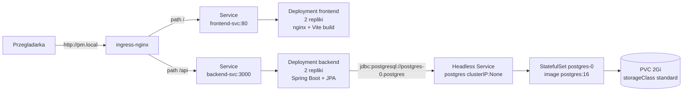

# Państwa Miasta

Multiplayerowa gra słowna "Państwa Miasta" wdrożona na lokalnym klastrze Kubernetes z wykorzystaniem `minikube`. 
## Architektura




| Komponent  | Technologia                           | Folder           | 
| ---------- | ------------------------------------- | ---------------- | 
| Frontend   | React 19 + Vite + Tailwind + nginx    | `frontend/`      | 
| Backend    | Spring Boot 4 (Java 21) + Spring Data JPA | `backend/` | 
| Baza       | PostgreSQL 16 (StatefulSet + PVC)     | -                | 
| Ekspozycja | ingress-nginx, path-based             | `k8s/40-ingress` | 

Frontend komunikuje się z backendem przez **relatywny** prefix `/api` (zob. [`frontend/src/services/api.ts`](frontend/src/services/api.ts)) — ten sam build chodzi za Ingressem niezależnie od hosta.

## Struktura 

```
.
├── backend/        # Spring Boot (Java 21) + Spring Data JPA
│   ├── src/main/java/  # kontroler, serwis, encje, repozytorium
│   ├── pom.xml
│   ├── Dockerfile      # multi-stage: maven build -> temurin JRE
│   └── openapi.yaml    # specyfikacja API
├── frontend/           # React/Vite + nginx
│   ├── src/
│   ├── Dockerfile      # multi-stage: node build -> nginx serve
│   └── nginx.conf      # SPA fallback (try_files ... /index.html)
├── k8s/                # manifesty Kubernetes (Lab 2-5 + 8)
│   ├── 00-namespace.yaml
│   ├── 10-postgres-secret.yaml
│   ├── 11-postgres-service.yaml
│   ├── 12-postgres-statefulset.yaml
│   ├── 20-backend-configmap.yaml
│   ├── 21-backend-deployment.yaml
│   ├── 22-backend-service.yaml
│   ├── 30-frontend-deployment.yaml
│   ├── 31-frontend-service.yaml
│   └── 40-ingress.yaml
└── chat_export.json      # plik kontekstu LLM 
```

## Wykorzystanie LLM

Szkielet frontendu został stworzony ręcznie. LLM wykorzystano do poprawy wyglądu, dodania stylów (Tailwind) i dopracowania pełnego interfejsu, m.in. nagłówków rundy, formularzy odpowiedzi, panelu głosowania i ekranu wyników.

LLM wygenerowało specyfikację REST API: listę endpointów, schematy request/response, opisy przepływu gry i punktacji.

Backend, manifesty Kubernetes oraz instrukcja wdrożenia w tym README zostały opracowane ręcznie, z okazjonalnym wsparciem LLM przy refaktoryzacji i dokumentacji bez przekazania LLM pełnej odpowiedzialności za logikę biznesową ani konfigurację klastra.

## Wymagania

- `minikube` >= 1.38, `kubectl`, Docker 
- Lokalnie do dev: JDK 21 + Maven (lub `./mvnw`), Node.js 18+ i npm dla frontendu

## Uruchomienie w minikube

### 1. Start klastra + addon Ingress

```bash
minikube start --memory=4096 --cpus=2 --driver=docker
minikube addons enable ingress
```

### 2. Build obrazów w demonie minikube

Dzięki temu Kubernetes znajduje obrazy lokalnie i nie próbuje ich ściągać z rejestru (manifesty mają `imagePullPolicy: Never`).

```bash
eval $(minikube -p minikube docker-env --shell bash)
docker build -t pm-backend:3.0 backend/
docker build -t pm-frontend:1.0 frontend/
```

### 3. Apply manifestów

```bash
kubectl apply -f k8s/
kubectl wait --for=condition=Ready pod --all -n pm-app --timeout=180s
kubectl get all,pvc,ingress -n pm-app
```

### 4. Patch ingress-nginx-controller na LoadBalancer

`minikube tunnel` przypisuje `EXTERNAL-IP` wyłącznie serwisom typu `LoadBalancer`. Domyślny addon tworzy serwis `NodePort`, więc patch jest wymagany jednorazowo po każdym świeżym starcie klastra:

```bash
kubectl patch svc ingress-nginx-controller \
  -n ingress-nginx \
  -p '{"spec":{"type":"LoadBalancer"}}'
```

### 5. Wpis w `/etc/hosts`

Po uruchomieniu tunnela (krok 6) serwis dostanie `EXTERNAL-IP = 127.0.0.1`. Dodaj wpis raz na stałe:

```bash
echo "127.0.0.1 pm.local" | sudo tee -a /etc/hosts

# Windows:
# C:\Windows\System32\drivers\etc\hosts
# 127.0.0.1 pm.local
```

### 6. Uruchomienie tunnela

W osobnym terminalu:

```bash
minikube tunnel
```

Sprawdzenie, czy serwis ma `EXTERNAL-IP`:

```bash
kubectl get svc -n ingress-nginx ingress-nginx-controller
# NAME                       TYPE           CLUSTER-IP     EXTERNAL-IP   PORT(S)
# ingress-nginx-controller   LoadBalancer   10.x.x.x       127.0.0.1     80:xxxxx/TCP,443:xxxxx/TCP
```

### 7. Weryfikacja end-to-end

```bash
curl http://pm.local/                              # frontend -> 200
curl http://pm.local/api/rooms                     # backend -> []
curl -X POST -H 'Content-Type: application/json' \
     -d '{"nick":"tester","isPublic":true}' \
     http://pm.local/api/rooms                     # backend -> {code, playerId}
curl http://pm.local/api/rooms                     # zwraca utworzony pokoj
kubectl exec -n pm-app postgres-0 -- \
     psql -U pm -d pm -c 'SELECT code, status FROM rooms;'   # wiersz w bazie
```

Aplikacja w przeglądarce: <http://pm.local>

### Komendy diagnostyczne

```bash
kubectl get all,pvc,ingress -n pm-app
kubectl logs -n pm-app deploy/backend -f
kubectl logs -n pm-app statefulset/postgres
kubectl describe pod -n pm-app postgres-0
kubectl exec -it -n pm-app postgres-0 -- psql -U pm -d pm
kubectl top pod -n pm-app                            # wymaga `minikube addons enable metrics-server`
kubectl port-forward -n pm-app svc/backend-svc 3000:3000   # debug API bez Ingressa i tunnela
```

### Sprzątanie

```bash
kubectl delete -f k8s/
minikube delete
```

## Konfiguracja


|                           | Gdzie                                                                                       | Domyślnie                                              |
| --------------------------- | ------------------------------------------------------------------------------------------- | ------------------------------------------------------ |
| Hasło, user i baza Postgres | [`k8s/10-postgres-secret.yaml`](k8s/10-postgres-secret.yaml) (base64)                       | `pm` / `pmpass` / `pm`                                 |
| Datasource URL (host, baza) | [`k8s/20-backend-configmap.yaml`](k8s/20-backend-configmap.yaml)                            | `jdbc:postgresql://postgres-0.postgres.pm-app.svc...:5432/pm` |
| Rozmiar wolumenu Postgres   | [`k8s/12-postgres-statefulset.yaml`](k8s/12-postgres-statefulset.yaml) (`volumeClaimTemplates`) | 2Gi, `storageClassName: standard`                  |
| Liczba replik frontendu     | [`k8s/30-frontend-deployment.yaml`](k8s/30-frontend-deployment.yaml)                        | 2 (stateless)                                          |
| Liczba replik backendu      | [`k8s/21-backend-deployment.yaml`](k8s/21-backend-deployment.yaml)                          | 2 (auto-stop trzymany w PostgreSQL — skalowalne)       |
| Requests / limits CPU + RAM | Wszystkie Deployment/StatefulSet                                                            | zob. manifesty (Lab 8)                                 |
| Routing / host              | [`k8s/40-ingress.yaml`](k8s/40-ingress.yaml)                                                | `host: pm.local`, `/api` -> backend, `/` -> frontend  |

## API

Specyfikacja OpenAPI: [`backend/openapi.yaml`](backend/openapi.yaml).

Najważniejsze endpointy:

- `GET /api/rooms` - lista publicznych pokoi w lobby
- `POST /api/rooms` - utworzenie pokoju (`{nick, isPublic}`)
- `POST /api/rooms/:code/join` - dołączenie do pokoju
- `GET /api/rooms/:code` - pełny stan pokoju (używane do pollingu)
- `POST /api/rooms/:code/settings` - zmiana ustawień (host)
- `POST /api/rooms/:code/start` / `/stop` / `/answers` / `/vote` / `/next-round` / `/reset` - przebieg gry

Backend trzyma stan pokoi w tabeli `rooms` (klucz główny = `code`) oraz `players` w bazie `pm`. Zagnieżdżone struktury (`scores`, `answers`, `votes`, `stoppedPlayers`, `categories`) są kolumnami `JSONB`. Schemat tworzy Hibernate (`ddl-auto=update`).

## Ograniczenia

- **Restart Postgresa**: PVC `postgres-data-postgres-0` przeżywa restart Poda, ale `kubectl delete -f k8s/` usuwa też StatefulSet - PVC zostaje (standardowy StorageClass w minikube) i zostanie ponownie zbindowany po re-applyu.
- **Pierwszy start backendu** jest wolniejszy (start JVM + utworzenie schematu przez Hibernate), dlatego sondy mają podwyższone `initialDelaySeconds`.

## Architektura auto-stop

Czas trwania rundy jest przechowywany jako `game.roundEndsAt` (Unix ms, kolumna `round_ends_at`) w wierszu pokoju - brak timerów w pamięci procesu. Przy każdym pollu `GET /api/rooms/{code}` backend wykonuje pojedynczy atomowy `UPDATE` (Spring Data `@Modifying`):

```sql
UPDATE rooms SET status = 'reviewing'
WHERE code = :code AND status = 'playing' AND round_ends_at <= :now
```

PostgreSQL gwarantuje, że zapis wiersza wykona się co najwyżej raz, nawet gdy kilka replik backendu odpowiada równolegle. Dzięki temu Deployment backendu można swobodnie skalować (`replicas: 2` i więcej). `mainTimeLeft` nie jest persystowane - backend liczy je na każdym odczycie jako `max(0, (roundEndsAt - now) / 1000)`.
