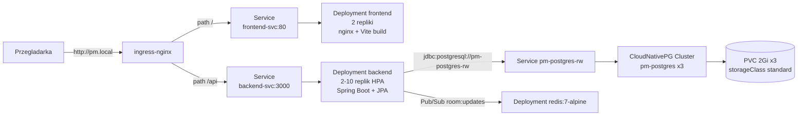

# Państwa Miasta

Multiplayerowa gra słowna "Państwa Miasta" wdrożona na lokalnym klastrze Kubernetes z wykorzystaniem `minikube` i **Helm** (Lab 12).

## Architektura




| Komponent  | Technologia                           | Folder           | 
| ---------- | ------------------------------------- | ---------------- | 
| Frontend   | React 19 + Vite + Tailwind + nginx    | `frontend/`      | 
| Backend    | Spring Boot 4 (Java 21) + Spring Data JPA | `backend/` | 
| Baza       | PostgreSQL 16 (CloudNativePG Cluster, 3 instancje) | `helm/pm/templates/postgres-cluster.yaml` |
| Redis      | redis:7-alpine (Pub/Sub broadcast WS) | `helm/pm/templates/redis-*.yaml` |
| Wdrożenie  | Helm chart `pm`                       | `helm/pm/`       | 
| Ekspozycja | ingress-nginx, path-based             | `helm/pm/templates/ingress.yaml` | 

Frontend komunikuje się z backendem przez **relatywny** prefix `/api` (zob. [`frontend/src/services/api.ts`](frontend/src/services/api.ts)) — ten sam build chodzi za Ingressem niezależnie od hosta.

Stan pokoju (lobby + gra) synchronizowany jest przez **WebSocket** (`/api/ws/rooms/{code}`) — hook [`useRoomWebSocket.ts`](frontend/src/hooks/useRoomWebSocket.ts). Mutacje (start, stop, głosowanie) nadal idą przez REST. Lista publicznych pokoi na stronie głównej nadal używa REST co 3s.

## Struktura 

```
.
├── backend/        # Spring Boot (Java 21) + Spring Data JPA
│   ├── src/main/java/
│   ├── pom.xml
│   ├── Dockerfile
│   └── openapi.yaml
├── frontend/       # React/Vite + nginx
│   ├── src/
│   ├── Dockerfile
│   └── nginx.conf
├── helm/pm/        # Helm chart (Lab 12)
│   ├── Chart.yaml
│   ├── values.yaml
│   ├── values-minikube.yaml
│   ├── values-prod.yaml
│   └── templates/  # namespace, cnpg postgres, redis, backend, frontend, ingress, hpa
└── chat_export.json
```

## Wymagania

- `minikube` >= 1.38, `kubectl`, `helm` >= 3.x, Docker
- Lokalnie do dev: JDK 21 + Maven (lub `./mvnw`), Node.js 18+ i npm dla frontendu

Komendy Helm uruchamiaj z katalogu głównego projektu (`/home/wojtek/projekty/k8s`). Chart podawaj jako **`./helm/pm`** (z `./`) — inaczej Helm interpretuje `helm/pm` jako repozytorium `helm` i chart `pm` → błąd `repo helm not found`.

## Uruchomienie w minikube

### 1. Start klastra + addony

```bash
minikube start --memory=4096 --cpus=2 --driver=docker
minikube addons enable ingress
minikube addons enable metrics-server   # wymagane dla HPA i kubectl top
```

### 2. CloudNativePG operator (jednorazowo)

```bash
helm repo add cnpg https://cloudnative-pg.github.io/charts
helm upgrade --install cnpg cnpg/cloudnative-pg -n cnpg-system --create-namespace
```

Na minikube **nie** instaluj pluginu Barman — backupy włączane są tylko w prod (`values-prod.yaml`).

### 3. Build obrazów w demonie minikube

```bash
eval $(minikube -p minikube docker-env --shell bash)
docker build -t pm-backend:3.0 backend/
docker build -t pm-frontend:1.0 frontend/
```

### 4. Secret Postgres (poza chartem — hasła nie trafiają do git)

Secret musi istnieć **przed** `helm install` — CloudNativePG `Cluster` odwołuje się do `postgres-credentials` przy bootstrap.

```bash
kubectl create namespace pm-app --dry-run=client -o yaml | kubectl apply -f -

kubectl create secret generic postgres-credentials \
  --from-literal=username=pm \
  --from-literal=password=pmpass \
  --from-literal=POSTGRES_USER=pm \
  --from-literal=POSTGRES_PASSWORD=pmpass \
  --from-literal=POSTGRES_DB=pm \
  -n pm-app --dry-run=client -o yaml | kubectl apply -f -
```

Klucze `username`/`password` — wymagane przez CNPG; `POSTGRES_*` — kompatybilność wsteczna.

### 5. Wdrożenie Helm chart

Używaj **`helm upgrade --install`** — tworzy release przy pierwszym uruchomieniu i aktualizuje przy kolejnych.

```bash
helm upgrade --install pm ./helm/pm -n pm-app \
  -f helm/pm/values.yaml \
  -f helm/pm/values-minikube.yaml

kubectl wait --for=jsonpath='{.status.phase}'="Cluster in healthy state" \
  cluster/pm-postgres -n pm-app --timeout=300s
kubectl wait --for=condition=Ready pod --all -n pm-app --timeout=180s
kubectl get all,hpa,ingress -n pm-app
helm list -n pm-app
```

Walidacja przed wdrożeniem (Lab 12):

```bash
helm lint ./helm/pm \
  -f helm/pm/values.yaml \
  -f helm/pm/values-minikube.yaml

helm template pm ./helm/pm \
  -f helm/pm/values.yaml \
  -f helm/pm/values-minikube.yaml

helm upgrade --install pm ./helm/pm -n pm-app \
  -f helm/pm/values.yaml \
  -f helm/pm/values-minikube.yaml \
  --dry-run
```

Aktualizacja i rollback:

```bash
helm upgrade --install pm ./helm/pm -n pm-app \
  -f helm/pm/values.yaml \
  -f helm/pm/values-minikube.yaml

helm history pm -n pm-app
helm rollback pm 1 -n pm-app
```

### 5. Patch ingress-nginx-controller na LoadBalancer

`minikube tunnel` przypisuje `EXTERNAL-IP` wyłącznie serwisom typu `LoadBalancer`. Patch jest wymagany jednorazowo po każdym świeżym starcie klastra:

```bash
kubectl patch svc ingress-nginx-controller \
  -n ingress-nginx \
  -p '{"spec":{"type":"LoadBalancer"}}'
```

### 6. Wpis w `/etc/hosts`

```bash
echo "127.0.0.1 pm.local" | sudo tee -a /etc/hosts

# Windows: C:\Windows\System32\drivers\etc\hosts
# 127.0.0.1 pm.local
```

### 7. Uruchomienie tunnela

W **osobnym terminalu** (proces musi działać cały czas):

```bash
minikube tunnel
```

Sprawdzenie:

```bash
kubectl get svc -n ingress-nginx ingress-nginx-controller
# EXTERNAL-IP powinno być 127.0.0.1 gdy tunnel działa
```

Jeśli tunnel nie startuje:

```bash
sudo pkill -f "minikube tunnel"    # zabij wiszący proces
minikube tunnel --cleanup          # opcjonalnie
minikube tunnel                    # ponownie w osobnym terminalu (może wymagać sudo)
```

Typowe przyczyny: stary proces tunelu w tle, brak uprawnień sudo do portów 80/443, uruchomienie tunelu w tym samym terminalu co inne komendy (zamiast osobnego okna).

### 8. Weryfikacja end-to-end

```bash
curl http://pm.local/
curl http://pm.local/api/rooms
curl -X POST -H 'Content-Type: application/json' \
     -d '{"nick":"tester","isPublic":true}' \
     http://pm.local/api/rooms
kubectl exec -n pm-app pm-postgres-1 -- psql -U postgres -d pm -c 'SELECT code, status FROM rooms;'
```

Aplikacja w przeglądarce: <http://pm.local>

### Komendy diagnostyczne

```bash
kubectl get all,pvc,ingress,hpa -n pm-app
helm status pm -n pm-app
kubectl logs -n pm-app deploy/backend -f
kubectl top pod -n pm-app
kubectl describe hpa backend-hpa -n pm-app
kubectl port-forward -n pm-app svc/backend-svc 3000:3000
```

### Sprzątanie

```bash
helm uninstall pm -n pm-app
kubectl delete secret postgres-credentials -n pm-app
kubectl delete namespace pm-app
minikube delete
```

### Odtworzenie po restarcie minikube

Po `minikube delete` / restarcie klastra release Helm znika. Pełna sekwencja od nowa: kroki 1 → 2 (CNPG operator) → 4 (namespace + secret) → 5 (`helm upgrade --install`) → tunnel → 8.

## Konfiguracja

Parametry bazowe: [`helm/pm/values.yaml`](helm/pm/values.yaml). Override minikube: [`helm/pm/values-minikube.yaml`](helm/pm/values-minikube.yaml). Prod + Barman: [`helm/pm/values-prod.yaml`](helm/pm/values-prod.yaml).

|                           | Gdzie                                                                                       | Domyślnie                                              |
| --------------------------- | ------------------------------------------------------------------------------------------- | ------------------------------------------------------ |
| Postgres mode               | `values.yaml` → `postgres.mode`                                                             | `cnpg` (legacy StatefulSet: `legacy`)                  |
| CNPG Cluster                | `values.yaml` → `postgres.cnpg.*`                                                           | `pm-postgres`, 3 instancje, `max_connections: 200`     |
| Flyway baseline (brownfield)| `values-minikube.yaml` → `postgres.flyway.baselineOnMigrate`                                  | `true` jednorazowo, potem `false`                      |
| Hasło Postgres              | Secret `postgres-credentials` (klucze `username`/`password` + `POSTGRES_*`)                 | `pm` / `pmpass` / `pm`                                 |
| Datasource URL              | `configmap.yaml` → `pm.postgres.jdbcUrl`                                                    | `pm-postgres-rw.pm-app.svc...:5432/pm`                 |
| HikariCP pool               | `values.yaml` → `backend.hikari.maximumPoolSize`                                            | 5 (10 podów HPA × 5 = 50 połączeń)                     |
| Rozmiar wolumenu Postgres   | `values.yaml` → `postgres.cnpg.storage`                                                     | 2Gi × 3, `storageClassName: standard`                  |
| Liczba replik frontendu     | `values.yaml` → `frontend.replicas`                                                         | 2                                                      |
| Liczba replik backendu      | `values.yaml` → `backend.replicas` + `hpa.*`                                                | min 2, max 10 (HPA: **tylko CPU** 70%)                 |
| Obrazy Docker               | `values.yaml` → `backend.image`, `frontend.image`                                           | `pm-backend:3.0`, `pm-frontend:1.0`                    |
| imagePullPolicy (minikube)  | `values-minikube.yaml` → `global.imagePullPolicy`                                           | `Never`                                                |
| Routing / host              | `values.yaml` → `ingress.host`                                                             | `pm.local`, `/api` → backend, `/` → frontend           |

## Helm (Lab 12)

Chart [`helm/pm/`](helm/pm/) pakuje wszystkie zasoby Kubernetes aplikacji:

- **Chart.yaml** — metadane chartu (`name: pm`, `version: 0.1.0`)
- **values.yaml** — domyślne wartości (bez haseł; tylko `postgres.credentialsSecret`)
- **values-minikube.yaml** — override minikube: `imagePullPolicy: Never`, `namespace.create: false`
- **values-prod.yaml** — prod: Barman backup, `primaryUpdateStrategy: supervised`, wyższe resources
- **templates/** — szablony Go Template generujące manifesty

Secret Postgres **nie jest** w repozytorium — tworzony ręcznie przed wdrożeniem. Opcjonalnie `postgres.credentials.create: true` + `--set postgres.credentials.user=... --set postgres.credentials.password=...` tylko na lokalny dev (nie commitować haseł).

Walidacja chartu (Lab 12): `helm lint`, `helm template`, `helm upgrade --install --dry-run`.

## API

Specyfikacja OpenAPI: [`backend/openapi.yaml`](backend/openapi.yaml).

Najważniejsze endpointy:

- `GET /api/rooms` - lista publicznych pokoi w lobby
- `POST /api/rooms` - utworzenie pokoju (`{nick, isPublic}`)
- `POST /api/rooms/:code/join` - dołączenie do pokoju
- `GET /api/rooms/:code` - pełny stan pokoju (REST fallback; główny sync przez WebSocket)
- `WS /api/ws/rooms/:code` - push stanu pokoju (subscribe + ping/pong)
- `POST /api/rooms/:code/settings` / `/start` / `/stop` / `/answers` / `/vote` / `/next-round` / `/reset` / `/leave`

## PostgreSQL (CloudNativePG)

Baza działa jako **CloudNativePG `Cluster`** (`pm-postgres`, 3 instancje = quorum). Backend łączy się przez serwis **`pm-postgres-rw`**. PDB (`maxUnavailable: 1`) chroni przed jednoczesnym evictem wielu instancji przy `kubectl drain`.

### Migracja ze starego StatefulSet

PVC `postgres-data-postgres-0` **nie jest** adoptowany przez CNPG.

1. `pg_dump` ze starego `postgres-0` (przed usunięciem StatefulSet)
2. `helm upgrade` z `postgres.mode=cnpg`
3. Poczekaj: `kubectl wait --for=jsonpath='{.status.phase}'="Cluster in healthy state" cluster/pm-postgres -n pm-app --timeout=300s`
4. `pg_restore` do `pm-postgres-rw`

### Flyway (migracje schematu)

Schemat zarządza **Flyway** przy starcie backendu (`spring-boot-starter-flyway` + `flyway-database-postgresql`).
Hibernate: `ddl-auto=validate` — nie modyfikuje schematu.

Migracje: [`backend/src/main/resources/db/migration/`](backend/src/main/resources/db/migration/)

| Plik | Opis |
|------|------|
| `V1__initial_schema.sql` | Pełny schemat (świeże bazy) |
| `V2__players_fk_cascade.sql` | Idempotentny fix FK CASCADE (brownfield) |

**Nowa migracja:** dodaj `V3__opis.sql`, rebuild backendu, restart deploymentu.

**Brownfield** (baza CNPG utworzona przez stary `ddl-auto=update`, bez `flyway_schema_history`):

1. W [`values-minikube.yaml`](helm/pm/values-minikube.yaml): `postgres.flyway.baselineOnMigrate: true`
2. `helm upgrade` + restart backendu → baseline v1 + uruchomienie V2
3. Po sukcesie ustaw z powrotem `baselineOnMigrate: false`

**Lokalny test (przed docker build):**

```bash
docker run --rm -d --name pm-pg-test -e POSTGRES_DB=pm -e POSTGRES_USER=pm \
  -e POSTGRES_PASSWORD=pmpass -p 5432:5432 postgres:16
docker run --rm -d --name pm-redis-test -p 6379:6379 redis:7-alpine
cd backend
export SPRING_DATASOURCE_URL=jdbc:postgresql://localhost:5432/pm
export SPRING_DATASOURCE_USERNAME=pm SPRING_DATASOURCE_PASSWORD=pmpass
export FLYWAY_BASELINE_ON_MIGRATE=false
./mvnw spring-boot:run
```

### Test failover (lab)

```bash
PRIMARY=$(kubectl get cluster pm-postgres -n pm-app -o jsonpath='{.status.currentPrimary}')
kubectl exec -n pm-app "$PRIMARY" -- \
  psql -U postgres -d pm -c "SELECT application_name, state, sent_lsn, write_lsn FROM pg_stat_replication;"
kubectl delete pod "$PRIMARY" -n pm-app
kubectl wait --for=jsonpath='{.status.phase}'="Cluster in healthy state" \
  cluster/pm-postgres -n pm-app --timeout=120s
kubectl get cluster pm-postgres -n pm-app -o jsonpath='New primary: {.status.currentPrimary}{"\n"}'
curl http://pm.local/api/rooms
```

### Prod: backup Barman PITR

```bash
helm upgrade --install cnpg-plugin-barman-cloud cnpg/plugin-barman-cloud -n cnpg-system
kubectl create secret generic pm-postgres-s3-credentials \
  --from-literal=ACCESS_KEY_ID=... --from-literal=SECRET_ACCESS_KEY=... -n pm-app
helm upgrade --install pm ./helm/pm -n pm-app \
  -f helm/pm/values.yaml -f helm/pm/values-prod.yaml \
  --set postgres.cnpg.backup.destinationPath=s3://YOUR-BUCKET/pm-postgres/
```

## Ograniczenia

- **CloudNativePG PVC**: każda instancja ma własny PVC; `helm uninstall` nie usuwa PVC domyślnie.
- **Flyway brownfield**: jednorazowo `postgres.flyway.baselineOnMigrate: true` w values-minikube; potem wyłącz.

- **Pierwszy start backendu** jest wolniejszy (JVM + Hibernate schema), stąd podwyższone `initialDelaySeconds` w sondach.
- **`helm upgrade` bez release**: samo `helm upgrade` failuje, gdy release nie istnieje — używaj `helm upgrade --install`.

## Architektura auto-stop i WebSocket

Czas trwania rundy jest przechowywany jako `game.roundEndsAt` (Unix ms) w PostgreSQL. Scheduler co 1s sprawdza **tylko pokoje z aktywnymi subskrypcjami WebSocket** na danym podzie i wykonuje atomowy `UPDATE`:

```sql
UPDATE rooms SET status = 'reviewing'
WHERE code = :code AND status = 'playing' AND round_ends_at <= :now
```

Dzięki temu backend można skalować (HPA 2–10 replik). Po każdej mutacji REST backend publikuje kod pokoju do **Redis Pub/Sub** (`room:updates`); każda replika pushuje świeży stan do swoich klientów WS. `mainTimeLeft` liczone dynamicznie przy pushu; frontend odlicza lokalnie między pushami.

**Redis** — 1 replika wystarczy na lab; restart Redisa zrywa subskrypcje Pub/Sub (klienci WS reconnectują). W prod rozważ Redis Sentinel / ElastiCache.

### Cleanup pokoi (TTL) i wyjście

- **`POST /api/rooms/{code}/leave`** — gracz opuszcza pokój w dowolnej fazie; ostatni gracz kasuje pokój od razu.
- Gdy **nikt nie ma aktywnego WebSocket** w pokoju, Redis ustawia TTL: **3 min** (lobby/finished) lub **10 min** (playing/reviewing) — czas na reconnect po zamknięciu karty / F5.
- Ponowne **subscribe WS** anuluje TTL; po wygaśnięciu klucza pokój jest usuwany z Postgres.
- Konfiguracja: `APP_ROOM_TTL_LOBBY_SECONDS`, `APP_ROOM_TTL_IN_GAME_SECONDS` w ConfigMap (domyślnie 180 / 600).
- Redis wymaga `--notify-keyspace-events Ex` (w chart Helm). Event `expired` może przyjść z lekkim opóźnieniem (lazy expiration).

Po zmianach backendu wymagany rebuild obrazu:

```bash
eval $(minikube docker-env)
docker build -t pm-backend:3.0 backend/
docker build -t pm-frontend:1.0 frontend/   # po zmianach frontendu
helm upgrade --install pm ./helm/pm -n pm-app \
  -f helm/pm/values.yaml -f helm/pm/values-minikube.yaml
```

## HPA (Horizontal Pod Autoscaler)

Włączony w chart (`hpa.enabled: true`). Wymaga addonu `metrics-server`.

Skaluje backend **tylko po CPU** (`hpa.cpu.enabled: true`, cel 70%). Metryka pamięci jest **wyłączona** (`hpa.memory.enabled: false`) — JVM (Spring Boot) utrzymuje stały, wysoki footprint RAM niezależnie od ruchu; przy włączonej metryce pamięci HPA fałszywie skalował w górę do `maxReplicas` nawet przy `cpu: 1%`.

```bash
kubectl get hpa backend-hpa -n pm-app -w
kubectl top pod -n pm-app -l app=backend

# test obciążeniowy (skalowanie w górę po CPU)
kubectl run loadgen --image=busybox:1.36 --restart=Never -n pm-app -- \
  sh -c 'while true; do wget -q -O- http://backend-svc:3000/api/rooms; done'
kubectl delete pod loadgen -n pm-app   # po teście — HPA stopniowo wraca do min. 2
```

HPA pokazuje `cpu: <unknown>/70%` przez 1–2 minuty po starcie — metrics-server potrzebuje czasu na zebranie metryk z nowych podów.
