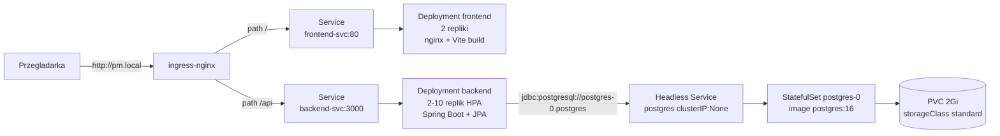

# Państwa Miasta

Multiplayerowa gra słowna "Państwa Miasta" wdrożona na lokalnym klastrze Kubernetes z wykorzystaniem `minikube` i **Helm** (Lab 12).

## Architektura




| Komponent  | Technologia                           | Folder           | 
| ---------- | ------------------------------------- | ---------------- | 
| Frontend   | React 19 + Vite + Tailwind + nginx    | `frontend/`      | 
| Backend    | Spring Boot 4 (Java 21) + Spring Data JPA | `backend/` | 
| Baza       | PostgreSQL 16 (StatefulSet + PVC)     | -                | 
| Wdrożenie  | Helm chart `pm`                       | `helm/pm/`       | 
| Ekspozycja | ingress-nginx, path-based             | `helm/pm/templates/ingress.yaml` | 

Frontend komunikuje się z backendem przez **relatywny** prefix `/api` (zob. [`frontend/src/services/api.ts`](frontend/src/services/api.ts)) — ten sam build chodzi za Ingressem niezależnie od hosta.

## Struktura 

```
.
├── backend/        # Spring Boot (Java 21) + Spring Data JPA
│   ├── src/main/java/
│   ├── pom.xml
│   ├── Dockerfile
│   └── openapi.yaml
├── frontend/       # React/Vite + nginx
│   ├── src/
│   ├── Dockerfile
│   └── nginx.conf
├── helm/pm/        # Helm chart (Lab 12)
│   ├── Chart.yaml
│   ├── values.yaml
│   ├── values-minikube.yaml
│   └── templates/  # namespace, postgres, backend, frontend, ingress, hpa
└── chat_export.json
```

## Wymagania

- `minikube` >= 1.38, `kubectl`, `helm` >= 3.x, Docker
- Lokalnie do dev: JDK 21 + Maven (lub `./mvnw`), Node.js 18+ i npm dla frontendu

Komendy Helm uruchamiaj z katalogu głównego projektu (`/home/wojtek/projekty/k8s`). Chart podawaj jako **`./helm/pm`** (z `./`) — inaczej Helm interpretuje `helm/pm` jako repozytorium `helm` i chart `pm` → błąd `repo helm not found`.

## Uruchomienie w minikube

### 1. Start klastra + addony

```bash
minikube start --memory=4096 --cpus=2 --driver=docker
minikube addons enable ingress
minikube addons enable metrics-server   # wymagane dla HPA i kubectl top
```

### 2. Build obrazów w demonie minikube

```bash
eval $(minikube -p minikube docker-env --shell bash)
docker build -t pm-backend:3.0 backend/
docker build -t pm-frontend:1.0 frontend/
```

### 3. Secret Postgres (poza chartem — hasła nie trafiają do git)

Secret musi istnieć **przed** `helm install` — Postgres startuje od razu i odwołuje się do `postgres-credentials`.

```bash
kubectl create namespace pm-app --dry-run=client -o yaml | kubectl apply -f -

kubectl create secret generic postgres-credentials \
  --from-literal=POSTGRES_USER=pm \
  --from-literal=POSTGRES_PASSWORD=pmpass \
  --from-literal=POSTGRES_DB=pm \
  -n pm-app --dry-run=client -o yaml | kubectl apply -f -
```

### 4. Wdrożenie Helm chart

Używaj **`helm upgrade --install`** — tworzy release przy pierwszym uruchomieniu i aktualizuje przy kolejnych.

```bash
helm upgrade --install pm ./helm/pm -n pm-app \
  -f helm/pm/values.yaml \
  -f helm/pm/values-minikube.yaml

kubectl wait --for=condition=Ready pod/postgres-0 -n pm-app --timeout=300s
kubectl wait --for=condition=Ready pod --all -n pm-app --timeout=180s
kubectl get all,hpa,ingress -n pm-app
helm list -n pm-app
```

Walidacja przed wdrożeniem (Lab 12):

```bash
helm lint ./helm/pm \
  -f helm/pm/values.yaml \
  -f helm/pm/values-minikube.yaml

helm template pm ./helm/pm \
  -f helm/pm/values.yaml \
  -f helm/pm/values-minikube.yaml

helm upgrade --install pm ./helm/pm -n pm-app \
  -f helm/pm/values.yaml \
  -f helm/pm/values-minikube.yaml \
  --dry-run
```

Aktualizacja i rollback:

```bash
helm upgrade --install pm ./helm/pm -n pm-app \
  -f helm/pm/values.yaml \
  -f helm/pm/values-minikube.yaml

helm history pm -n pm-app
helm rollback pm 1 -n pm-app
```

### 5. Patch ingress-nginx-controller na LoadBalancer

`minikube tunnel` przypisuje `EXTERNAL-IP` wyłącznie serwisom typu `LoadBalancer`. Patch jest wymagany jednorazowo po każdym świeżym starcie klastra:

```bash
kubectl patch svc ingress-nginx-controller \
  -n ingress-nginx \
  -p '{"spec":{"type":"LoadBalancer"}}'
```

### 6. Wpis w `/etc/hosts`

```bash
echo "127.0.0.1 pm.local" | sudo tee -a /etc/hosts

# Windows: C:\Windows\System32\drivers\etc\hosts
# 127.0.0.1 pm.local
```

### 7. Uruchomienie tunnela

W **osobnym terminalu** (proces musi działać cały czas):

```bash
minikube tunnel
```

Sprawdzenie:

```bash
kubectl get svc -n ingress-nginx ingress-nginx-controller
# EXTERNAL-IP powinno być 127.0.0.1 gdy tunnel działa
```

Jeśli tunnel nie startuje:

```bash
sudo pkill -f "minikube tunnel"    # zabij wiszący proces
minikube tunnel --cleanup          # opcjonalnie
minikube tunnel                    # ponownie w osobnym terminalu (może wymagać sudo)
```

Typowe przyczyny: stary proces tunelu w tle, brak uprawnień sudo do portów 80/443, uruchomienie tunelu w tym samym terminalu co inne komendy (zamiast osobnego okna).

### 8. Weryfikacja end-to-end

```bash
curl http://pm.local/
curl http://pm.local/api/rooms
curl -X POST -H 'Content-Type: application/json' \
     -d '{"nick":"tester","isPublic":true}' \
     http://pm.local/api/rooms
kubectl exec -n pm-app postgres-0 -- \
     psql -U pm -d pm -c 'SELECT code, status FROM rooms;'
```

Aplikacja w przeglądarce: <http://pm.local>

### Komendy diagnostyczne

```bash
kubectl get all,pvc,ingress,hpa -n pm-app
helm status pm -n pm-app
kubectl logs -n pm-app deploy/backend -f
kubectl top pod -n pm-app
kubectl describe hpa backend-hpa -n pm-app
kubectl port-forward -n pm-app svc/backend-svc 3000:3000
```

### Sprzątanie

```bash
helm uninstall pm -n pm-app
kubectl delete secret postgres-credentials -n pm-app
kubectl delete namespace pm-app
minikube delete
```

### Odtworzenie po restarcie minikube

Po `minikube delete` / restarcie klastra release Helm znika. Pełna sekwencja od nowa: kroki 1 → 3 (namespace + secret) → 4 (`helm upgrade --install`) → 5 → 7 (tunnel) → 8.

## Konfiguracja

Parametry bazowe: [`helm/pm/values.yaml`](helm/pm/values.yaml). Override minikube: [`helm/pm/values-minikube.yaml`](helm/pm/values-minikube.yaml) (`imagePullPolicy: Never`, `namespace.create: false`).

|                           | Gdzie                                                                                       | Domyślnie                                              |
| --------------------------- | ------------------------------------------------------------------------------------------- | ------------------------------------------------------ |
| Hasło Postgres              | Secret `postgres-credentials` (poza chartem, `kubectl create secret`)                       | `pm` / `pmpass` / `pm`                                 |
| Datasource URL              | `helm/pm/templates/configmap.yaml` (szablon JDBC)                                         | `postgres-0.postgres.pm-app.svc...:5432/pm`            |
| Rozmiar wolumenu Postgres   | `values.yaml` → `postgres.storage`                                                          | 2Gi, `storageClassName: standard`                      |
| Liczba replik frontendu     | `values.yaml` → `frontend.replicas`                                                         | 2                                                      |
| Liczba replik backendu      | `values.yaml` → `backend.replicas` + `hpa.*`                                                | min 2, max 10 (HPA: **tylko CPU** 70%)                 |
| Obrazy Docker               | `values.yaml` → `backend.image`, `frontend.image`                                           | `pm-backend:3.0`, `pm-frontend:1.0`                    |
| imagePullPolicy (minikube)  | `values-minikube.yaml` → `global.imagePullPolicy`                                           | `Never`                                                |
| Routing / host              | `values.yaml` → `ingress.host`                                                             | `pm.local`, `/api` → backend, `/` → frontend           |

## Helm (Lab 12)

Chart [`helm/pm/`](helm/pm/) pakuje wszystkie zasoby Kubernetes aplikacji:

- **Chart.yaml** — metadane chartu (`name: pm`, `version: 0.1.0`)
- **values.yaml** — domyślne wartości (bez haseł; tylko `postgres.credentialsSecret`)
- **values-minikube.yaml** — override minikube: `imagePullPolicy: Never`, `namespace.create: false`
- **templates/** — szablony Go Template generujące manifesty

Secret Postgres **nie jest** w repozytorium — tworzony ręcznie przed wdrożeniem. Opcjonalnie `postgres.credentials.create: true` + `--set postgres.credentials.user=... --set postgres.credentials.password=...` tylko na lokalny dev (nie commitować haseł).

Walidacja chartu (Lab 12): `helm lint`, `helm template`, `helm upgrade --install --dry-run`.

## API

Specyfikacja OpenAPI: [`backend/openapi.yaml`](backend/openapi.yaml).

Najważniejsze endpointy:

- `GET /api/rooms` - lista publicznych pokoi w lobby
- `POST /api/rooms` - utworzenie pokoju (`{nick, isPublic}`)
- `POST /api/rooms/:code/join` - dołączenie do pokoju
- `GET /api/rooms/:code` - pełny stan pokoju (polling)
- `POST /api/rooms/:code/settings` / `/start` / `/stop` / `/answers` / `/vote` / `/next-round` / `/reset`

## Ograniczenia

- **Restart Postgresa**: PVC `postgres-data-postgres-0` przeżywa `helm uninstall` (PVC nie jest usuwany domyślnie) i zostanie ponownie zbindowany przy re-install.
- **Pierwszy start backendu** jest wolniejszy (JVM + Hibernate schema), stąd podwyższone `initialDelaySeconds` w sondach.
- **`helm upgrade` bez release**: samo `helm upgrade` failuje, gdy release nie istnieje — używaj `helm upgrade --install`.

## Architektura auto-stop

Czas trwania rundy jest przechowywany jako `game.roundEndsAt` (Unix ms) w PostgreSQL. Przy każdym `GET /api/rooms/{code}` backend wykonuje atomowy `UPDATE`:

```sql
UPDATE rooms SET status = 'reviewing'
WHERE code = :code AND status = 'playing' AND round_ends_at <= :now
```

Dzięki temu backend można skalować (HPA 2–10 replik). `mainTimeLeft` liczone dynamicznie przy każdym odczycie.

## HPA (Horizontal Pod Autoscaler)

Włączony w chart (`hpa.enabled: true`). Wymaga addonu `metrics-server`.

Skaluje backend **tylko po CPU** (`hpa.cpu.enabled: true`, cel 70%). Metryka pamięci jest **wyłączona** (`hpa.memory.enabled: false`) — JVM (Spring Boot) utrzymuje stały, wysoki footprint RAM niezależnie od ruchu; przy włączonej metryce pamięci HPA fałszywie skalował w górę do `maxReplicas` nawet przy `cpu: 1%`.

```bash
kubectl get hpa backend-hpa -n pm-app -w
kubectl top pod -n pm-app -l app=backend

# test obciążeniowy (skalowanie w górę po CPU)
kubectl run loadgen --image=busybox:1.36 --restart=Never -n pm-app -- \
  sh -c 'while true; do wget -q -O- http://backend-svc:3000/api/rooms; done'
kubectl delete pod loadgen -n pm-app   # po teście — HPA stopniowo wraca do min. 2
```

HPA pokazuje `cpu: <unknown>/70%` przez 1–2 minuty po starcie — metrics-server potrzebuje czasu na zebranie metryk z nowych podów.
